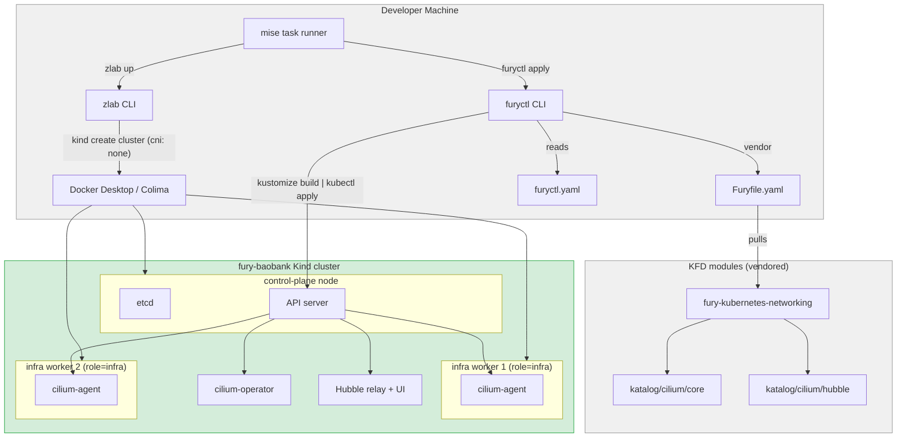
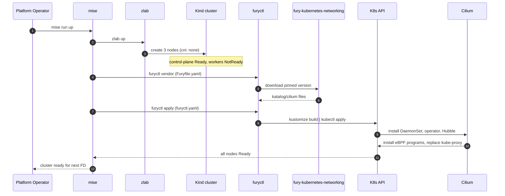

# FD-001: Kind multinode cluster with Cilium via furyctl (1cp + 2 infra)

## Problem / Problema

The `fury-baobank` lab needs a reproducible Kubernetes cluster that mirrors the topology of real Fury deployments (control plane + infra nodes), remains local and cost-free, and — critically — uses the **same installation path as a production KFD cluster**.

Two things must hold:

1. **Topology parity**: 3-node split (1 control-plane, 2 infra workers with `node-role.fury.io/infra=true`). Single-role Kind clusters do not let us test scheduling constraints, taints/tolerations, or node selectors that Bank-Vaults Operator and OpenBao StatefulSet rely on in production.

2. **Install-path parity**: Cilium must be installed via **furyctl** using the KFD `fury-kubernetes-networking` module (`katalog/cilium`), not via an ad-hoc Helm invocation. Reasons:
   - The lab validates production workflows, not lab-only shortcuts
   - furyctl pins Cilium versions, patches, and configuration via `Furyfile.yaml` + `furyctl.yaml` — same artifacts the team maintains downstream
   - Bank-Vaults Operator install and subsequent FDs will use furyctl's `customPatches` mechanism; using furyctl for networking keeps a single deployment idiom
   - Hubble is integrated as a sub-katalog (`katalog/cilium/hubble`) — declarative enablement, no extra Helm command

The default zlab Kind template uses **Calico** as the built-in CNI addon. This is acceptable for most labs but diverges from the KFD production trajectory (Cilium with kube-proxy replacement, eBPF data path, Hubble observability). For a lab that will later validate topology-aware routing of secret traffic, L7 network policies around OpenBao, and cross-namespace webhook flows, Calico is not representative.

We need: a 3-node Kind cluster (1 cp + 2 infra) created via zlab with `cni: none`, then Cilium installed via `furyctl apply` using a `KFDDistribution` config that references the `fury-kubernetes-networking` cilium module. All orchestrated by a single `mise run up`.

## Solutions Considered / Soluzioni Considerate

### Option A / Opzione A — Keep Calico via zlab addon, skip furyctl for CNI

- **Pro:** zero custom work, zlab default path, proven in other Fury labs (ingress-full, istio-full).
- **Pro:** faster cluster bootstrap — no post-cluster install step.
- **Con / Contro:** does not use the same install path as production KFD → lab does not validate the networking module vendor step.
- **Con / Contro:** no Hubble out of the box, and adding it later diverges from the KFD networking module defaults.
- **Con / Contro:** network policies with L7 matching (e.g., `allow only GET /v1/secret/data/*` to OpenBao) are not testable.
- **Con / Contro:** doesn't validate that the KFD Cilium module works on Kind — a useful test in itself.

### Option B / Opzione B — Cilium via Helm directly, bypassing furyctl

- **Pro:** minimal steps to add Cilium post-cluster.
- **Pro:** Helm values are the upstream Cilium reference.
- **Con / Contro:** uses a different install path than production KFD → drift between lab and real deployments.
- **Con / Contro:** duplicates version pinning and value management that `Furyfile.yaml` already handles.
- **Con / Contro:** no reuse of the KFD networking module — bugfixes and patches the team applies downstream would not flow into this lab.

### Option C (chosen) / Opzione C (scelta) — Cilium via furyctl using the KFD networking module

- **Pro:** matches the production KFD install path exactly — `Furyfile.yaml` vendors `fury-kubernetes-networking`, `furyctl.yaml` declares `networking.type: cilium`, `furyctl apply` does the rest.
- **Pro:** single deployment idiom across the entire lab — same `furyctl apply` cycle will later install Bank-Vaults Operator and OpenBao.
- **Pro:** Hubble enabled declaratively via the sub-katalog; no parallel Helm tree to maintain.
- **Pro:** validates that the KFD Cilium katalog works on Kind — useful regression coverage.
- **Pro:** any `customPatches` or lab-specific tweaks are versioned as first-class YAML under `manifests/`.
- **Con / Contro:** two-step cluster bootstrap (zlab up with `cni: none`, then `furyctl apply`). Documented and scripted via `mise`.
- **Con / Contro:** Kind needs eBPF mounts available (`/sys/fs/bpf`, `/proc/sys/net/core/bpf_jit_*`). Cilium chart handles mounts on Linux; macOS Docker Desktop / colima work with default settings but are documented in the lab README.

## Architecture / Architettura

### Integration Context / Contesto di Integrazione

### Data Flow / Flusso Dati

## Interfaces / Interfacce

| Component / Componente | Input | Output | Protocol / Protocollo |
|---|---|---|---|
| `.zlab.yaml` | config with `cni: none`, 3 nodes, infra labels | Kind cluster bare | zlab → Docker → Kind |
| `Furyfile.yaml` | version pin for `fury-kubernetes-networking` | vendored module files under `vendor/` | HTTP clone from upstream |
| `furyctl.yaml` | distribution spec with `networking.type: cilium`, Hubble enabled | manifests applied | furyctl → kustomize → kubectl |
| KFD networking module | kustomization targets | rendered YAML (Cilium + Hubble) | kustomize |
| Cilium DaemonSet | per-node install | eBPF routing, kube-proxy replacement | eBPF / kernel |
| Hubble relay | cilium-agent flow events | observability API | gRPC |
| mise task `up` | user invocation | fully configured cluster | CLI |

## Planned SDDs / SDD Previsti

1. **SDD-001: Kind cluster config with role labels and `cni: none`** — `.zlab.yaml` with 3 nodes (1 control-plane, 2 workers labeled `node-role.fury.io/infra=true`), `cni: none`, port mappings for lab services.
2. **SDD-002: `Furyfile.yaml` + `furyctl.yaml` for Cilium installation** — `Furyfile.yaml` pins the `fury-kubernetes-networking` module version; `furyctl.yaml` declares `networking.type: cilium` with Hubble enabled and Kind-compatible values (via `customPatches` if needed).
3. **SDD-003: Hubble exposure for local access** — NodePort or port-forward helper script, example Hubble queries documented.
4. **SDD-004: Integration wiring + E2E BATS test suite** — `mise run up` orchestrates zlab + furyctl vendor + furyctl apply; BATS tests validate node roles, Cilium pods Ready, `kube-proxy` DaemonSet absent, pod-to-pod connectivity, DNS resolution, Hubble reachability.

## Constraints / Vincoli

- Kind only — no cloud dependency (constraint `kind-only`).
- K8s 1.29+ compatibility (constraint `kubernetes-versions`). Target 1.31 for consistency with other Fury labs.
- Must use the pinned version of `fury-kubernetes-networking` from the workspace — same version as other labs, no custom forks.
- No MPL/BSL licensed components in the bootstrap path (constraint `no-hashicorp-bsl`). Cilium is Apache 2.0 — compliant.
- Cluster bootstrap must be idempotent — re-running `mise run up` on an existing cluster must be a no-op or safe update.
- No manual kubeconfig edits — all flow through zlab/furyctl standard paths.
- Infra nodes use labels (not taints) for this phase — simplifies lab workloads while still enabling test scheduling.

## Verification / Verifica

- [ ] Problem clearly defined
- [ ] At least 2 solutions with pros/cons
- [ ] Architecture diagram present
- [ ] Interfaces defined
- [ ] SDDs listed
- [ ] `mise run up` produces a 3-node cluster: 1 control-plane, 2 workers with `node-role.fury.io/infra=true`
- [ ] `furyctl vendor` successfully downloads `fury-kubernetes-networking` per Furyfile.yaml
- [ ] `furyctl apply` installs Cilium without errors
- [ ] `kubectl get pods -n kube-system` shows Cilium agents Ready on all nodes
- [ ] `kubectl get daemonset -n kube-system kube-proxy` returns NotFound (Cilium replaces it)
- [ ] Hubble relay reachable via port-forward or NodePort
- [ ] Pod-to-pod connectivity across infra workers validated (BATS)
- [ ] DNS resolution works for cluster services (BATS)
- [ ] `mise run up` is idempotent (second run does not fail or duplicate resources)
- [ ] Review completed (`/fd-review`)

## Notes / Note

- **Phase 0** — prerequisite for every other lab FD. No Bank-Vaults, no OpenBao, no application workloads in scope here.
- The KFD networking module with Cilium is at `modules/fury-kubernetes-networking/katalog/cilium/` in the Fury workspace — has `core/`, `hubble/`, and `tasks/` subdirs. Reuse without fork.
- Context files consulted: `docs/ARCHITECTURE.md`, `.forgia/constitution.md`, `.forgia/architecture/constraints.yaml`, `.forgia/architecture/technology-decisions.yaml` (TD-006 Kind choice; TD-003 Raft — out of scope here; no existing TD for CNI → this FD implicitly creates one).
- Future multi-zone experiments: label the 2 infra workers with different `topology.kubernetes.io/zone` values — no changes to this FD, purely additive config.
- **New TD to add after approval**: `TD-007 Cilium via KFD networking module` — document the install-path parity rationale.
- Reference: `modules/fury-kubernetes-networking/katalog/cilium/README.md` and `MAINTENANCE.md` for upstream values.
