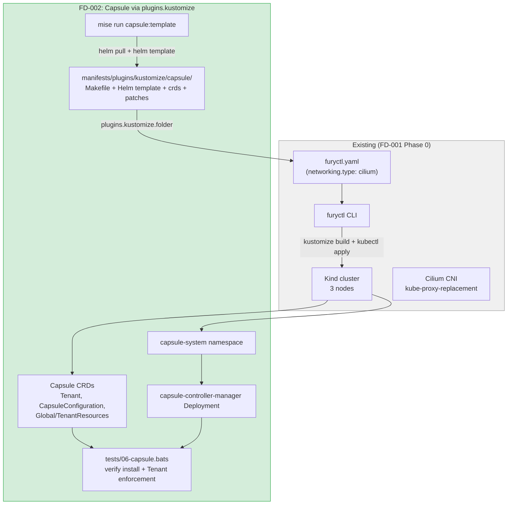
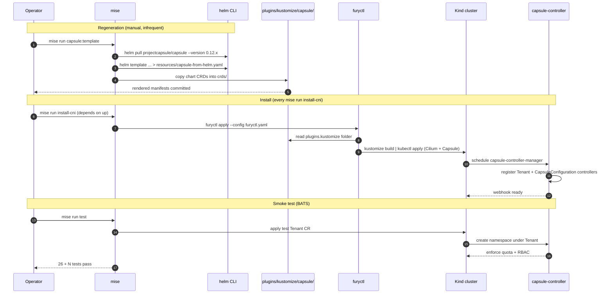

# FD-002: Capsule multi-tenancy via furyctl kustomize plugin

## Problem / Problema

The fury-baobank lab targets a multi-tenant pattern where each branch / customer eventually gets an isolated set of Kubernetes namespaces, RBAC, quotas, and (later) its own OpenBao instance. To validate that pattern we need a tenancy controller in the cluster — Capsule is the reference choice for KFD-style deployments (already present in `pec/infra` and proven in production at SIGHUP).

Two specific things are missing today:

1. **Capsule is not installed in the lab.** FD-001 declared `single-tenant-scope` and put Capsule explicitly out of scope. With FD-001 closed and the lab functional, we now need Capsule as the prerequisite for any per-tenant work (FD-003 OpenBao+Bank-Vaults will consume tenant boundaries).

2. **The kustomize boilerplate already in `manifests/plugins/kustomize/capsule/` is stale and unintegrated.** It pins Capsule chart **v0.6.2** (current upstream stable is **v0.12.4**, 6 minor versions behind). The Makefile uses `helm pull` + `helm template` to render the chart but is not wired into the `mise` lifecycle; nothing applies it to the cluster, no test confirms it works.

We need to:
- Refresh the boilerplate to a current Capsule release (chart v0.12.x).
- Wire the rendered manifests into `furyctl.yaml` via `plugins.kustomize` so `furyctl apply` installs Capsule alongside Cilium in a single declarative pass.
- Provide a regeneration recipe (`mise run capsule:template`) so the rendered file can be refreshed deterministically.
- Add BATS tests that prove Capsule is installed AND that a `Tenant` CR enforces the documented isolation (namespace creation gated, quota applied).

## Solutions Considered / Soluzioni Considerate

### Option A / Opzione A — Install Capsule via standalone Helm command in mise

A `mise run install-capsule` task that invokes `helm install projectcapsule/capsule ...` directly against the cluster.

- **Pro:** quickest to set up, no boilerplate to maintain — Helm handles upgrades natively.
- **Pro:** ergonomic for someone already familiar with Helm.
- **Con / Contro:** breaks the "everything via furyctl" pattern of the lab — diverges from how production KFD users consume modules.
- **Con / Contro:** no version pinning shared with the rest of the stack (Furyfile-style discipline lost).
- **Con / Contro:** harder to apply customPatches consistent with how furyctl patches Cilium.

### Option B / Opzione B — Vendor Capsule into `fury-kubernetes-*` and call from `furyctl.yaml` modules

Treat Capsule as a Fury module, similar to `fury-kubernetes-networking` for Cilium. The furyctl distribution would gain a `tenancy` block.

- **Pro:** the most "blessed" path long-term — production KFD would get a real Capsule module.
- **Pro:** keeps versions pinned via `kfd.yaml`, just like every other module.
- **Con / Contro:** out of scope for this lab — that's an upstream Fury contribution that would take weeks of design + review.
- **Con / Contro:** Capsule is not yet a sanctioned Fury module; we'd be inventing the schema unilaterally.

### Option C (chosen) / Opzione C (scelta) — Refactor the existing kustomize folder and consume it via furyctl `plugins.kustomize`

Refresh `manifests/plugins/kustomize/capsule/` (current v0.6.2 → v0.12.x), wire it into `furyctl.yaml` `plugins.kustomize.[].folder` so `furyctl apply` builds and applies it as part of the same run that installs Cilium.

- **Pro:** matches the existing Fury idiom — `plugins.kustomize` is the official extension point in `furyctl.yaml` for "things outside the standard modules".
- **Pro:** keeps Capsule version pinned explicitly inside the repo (Makefile records the chart version, the rendered manifest is the source of truth).
- **Pro:** integrates seamlessly with the `mise run install-cni` flow — no extra task to remember.
- **Pro:** when (in the future) Capsule becomes a real Fury module, migrating to Option B is a one-line change in `furyctl.yaml`.
- **Pro:** the refactor of the existing boilerplate doubles as a value-add (chart v0.6.2 is end-of-life — 2.5 years old).
- **Con / Contro:** the rendered Helm output (`capsule-from-helm.yaml`) is committed to the repo — large file, sometimes noisy diffs on regeneration.
- **Con / Contro:** regeneration (`mise run capsule:template`) is a manual step; we accept this for a lab and document it.

## Architecture / Architettura

### Integration Context / Contesto di Integrazione

### Data Flow / Flusso Dati

## Interfaces / Interfacce

| Component / Componente | Input | Output | Protocol / Protocollo |
|---|---|---|---|
| `manifests/plugins/kustomize/capsule/Makefile` | chart version (env or flag) | regenerated `resources/capsule-from-helm.yaml` + refreshed `crds/` | helm CLI |
| `manifests/plugins/kustomize/capsule/kustomization.yaml` | Helm-rendered manifests + patches + CRDs | kustomize-buildable bundle | kustomize |
| `furyctl.yaml` (`plugins.kustomize`) | `name + folder` entries | included in `furyctl apply` reconciliation | furyctl → kustomize → kubectl |
| `mise.toml` task `capsule:template` | nothing | regenerated boilerplate, ready to commit | mise + helm |
| `tests/06-capsule.bats` | running cluster post `install-cni` | test results (TAP) | bats |
| Capsule controller | `Tenant` CR | enforced namespaces, quotas, RBAC | K8s API |
| Capsule webhook | namespace create/update requests | admission allow/deny | K8s admission |

## Planned SDDs / SDD Previsti

1. **SDD-001: Refresh kustomize boilerplate to Capsule v0.12.x** — bump `Makefile` chart version, regenerate `resources/capsule-from-helm.yaml` and `crds/`, audit `patches/capsule-proxy-ca.yaml` and the `secretGenerator` (still relevant for the lab? if not, drop). Verify the rendered output diff is sensible — flag breaking changes.
2. **SDD-002: Wire `plugins.kustomize` in `furyctl.yaml`** — add the Capsule folder to `spec.plugins.kustomize` so `furyctl apply` includes it. Verify the Cilium install path is unaffected.
3. **SDD-003: BATS test suite for Capsule install + Tenant enforcement** — `tests/06-capsule.bats` covering: namespace exists, controller Ready, CRDs registered, webhook responsive, a sample `Tenant` creates a namespace with the correct quota + RBAC.
4. **SDD-004: Integration wiring + regeneration task** — `mise run capsule:template` for chart refresh; updated `mise.toml` so `install-cni` (or a new `install-capsule` step) installs Capsule alongside Cilium; `mise run all` extended to include Capsule tests.

## Constraints / Vincoli

- Capsule chart pinned by exact version in the Makefile (no floating `latest`).
- Helm-rendered manifest committed to the repo — diff reviewable in PRs.
- Must not break the existing `mise run all` flow that closed FD-001 with 26/26 tests.
- Must work on the same Kind cluster created by FD-001 (no new infra prerequisites).
- Capsule v0.12.x compatibility with Kubernetes 1.31 (verify via release notes; cap on K8s 1.32+ exists in some chart versions — confirm).
- Image references should follow the project's pinning discipline (digest preferred but tag acceptable for the lab — same trade-off documented in SDD-002 of FD-001).

## Verification / Verifica

- [ ] Problem clearly defined
- [ ] At least 2 solutions with pros/cons
- [ ] Architecture diagram present
- [ ] Interfaces defined
- [ ] SDDs listed
- [ ] Capsule chart pinned to a current upstream version (≥ v0.12.0)
- [ ] `mise run capsule:template` regenerates `resources/capsule-from-helm.yaml` deterministically
- [ ] `furyctl apply` installs Capsule as part of the same run that installs Cilium
- [ ] `kubectl get pods -n capsule-system` shows controller Ready
- [ ] `kubectl get crds | grep capsule` shows the expected CRDs registered
- [ ] BATS suite confirms a `Tenant` CR creates a namespace with the configured quota and RBAC bindings
- [ ] `mise run all` passes end-to-end (FD-001 26 tests + new Capsule tests)
- [ ] Review completed (`/fd-review`)

## Notes / Note

- **Phase 1 prep** — this FD is the prerequisite for FD-003 (OpenBao + Bank-Vaults) where each tenant will own its own Vault instance.
- Existing boilerplate at `manifests/plugins/kustomize/capsule/` (chart v0.6.2) was likely copied from `pec/infra` or another internal lab. Do NOT delete the `secrets/ssl/ca.crt` reference in `secretGenerator` until SDD-001 confirms whether the lab needs Capsule's TLS CA wiring (probably not for a single-cluster Kind lab; defer the decision to the SDD).
- Upstream notes:
  - Capsule chart releases: https://github.com/projectcapsule/capsule/releases (latest stable v0.12.4 at Dec 2024)
  - Helm repo: `https://projectcapsule.github.io/charts`
- Consider opening a downstream Fury proposal to add a sanctioned `tenancy` module (Option B from this FD) once we have lab evidence of the pattern's value.
- Context files consulted: `docs/ARCHITECTURE.md` (Capsule listed as Out of Scope), `.forgia/architecture/constraints.yaml` (the `single-tenant-scope` constraint we are now relaxing), `.forgia/fd/FD-001-kind-cluster-cilium.md` (parent infrastructure FD), `.forgia/CHANGELOG.md` (FD-001 closed entry).
