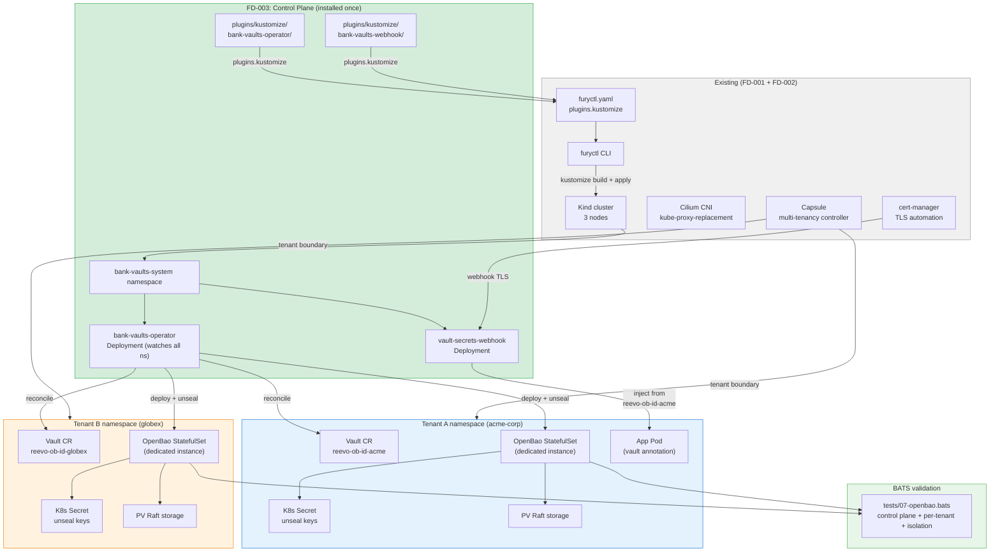
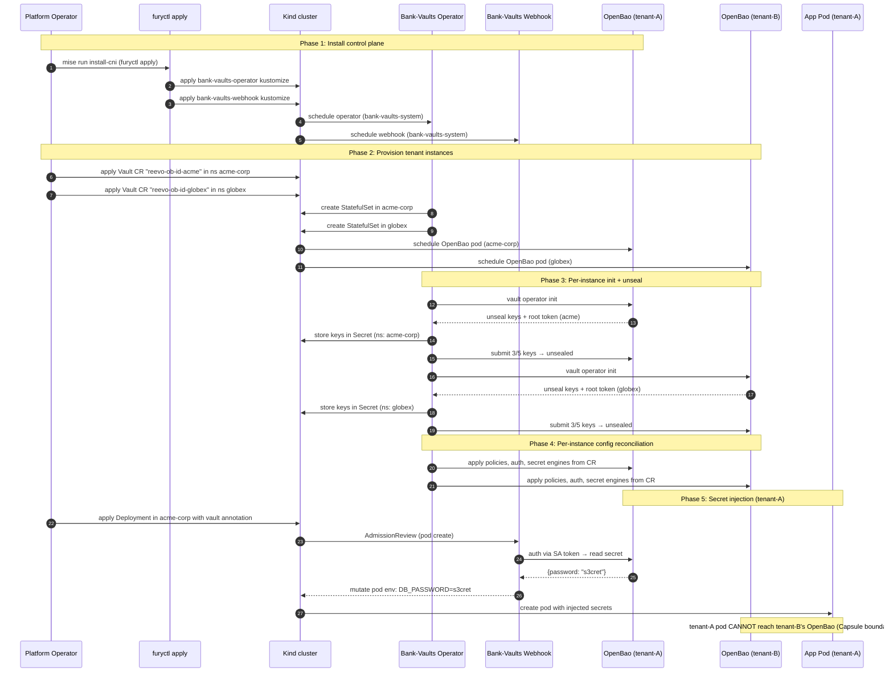

# FD-003: OpenBao secret management via Bank-Vaults operator

## Problem / Problema

The fury-baobank cluster now has network isolation (Cilium, FD-001) and tenant boundaries (Capsule, FD-002), but **zero secret management**. Application secrets are stored as plaintext Kubernetes Secrets in etcd — no encryption at rest beyond etcd's own (which uses a static key on Kind), no audit trail of who read what, no automatic rotation, and no isolation between tenants.

This is the core gap the lab was created to validate: can we deliver **OpenBao-as-a-Service** — a multi-tenant secret management platform where each customer gets a dedicated, isolated OpenBao instance?

The SaaS model requires:

1. **Dedicated instance per tenant** — each Capsule tenant gets its own OpenBao StatefulSet (`reevo-ob-id-<identifier>`), with its own storage, unseal keys, and root token. Isolation is physical (process-level), not just logical (policy-level).
2. **Automated provisioning** — onboarding a new customer = creating a Capsule Tenant + a `Vault` CR in the tenant namespace. The Bank-Vaults operator handles init, unseal, and configuration autonomously.
3. **Tenant-owned Vault** — the customer's OpenBao is theirs to use: storing secrets for apps in the same cluster, for apps on other clusters (via Vault client/agent), for CI/CD pipelines, or any other purpose. They interact with it via standard Vault API.
4. **Transparent injection** — for apps running in the same cluster, the Bank-Vaults webhook injects secrets into pods via annotations. No Vault client code in the app.
5. **Zero-touch unseal** — if an OpenBao pod restarts, the operator re-unseals it automatically. No 3 AM pager.
6. **Declarative lifecycle** — the entire stack installs via `furyctl apply`, matching the pattern established in FD-001 (Cilium) and FD-002 (Capsule).

Without this, the lab validates infrastructure plumbing but not the actual use case it was designed for: proving that OpenBao + Bank-Vaults on KFD can serve as the foundation for a multi-tenant SaaS offering.

## Solutions Considered / Soluzioni Considerate

### Option A / Opzione A — OpenBao standalone via furyctl kustomize plugin

Deploy OpenBao directly via Helm-rendered manifests in `manifests/plugins/kustomize/openbao/`, same pattern as Capsule (FD-002). No Bank-Vaults operator.

- **Pro:** Simplest deployment — one chart, one kustomize folder, no operator dependency.
- **Pro:** Direct control over OpenBao configuration; no abstraction layer between you and Vault.
- **Con / Contro:** Manual init + unseal — requires scripts or Terraform to configure policies, auth methods, secret engines after deploy. Not declarative.
- **Con / Contro:** No webhook injection — must use Vault Agent sidecar or CSI driver for secret delivery to pods. Both add operational surface per pod.
- **Con / Contro:** Auto-unseal requires custom scripts or a separate tool. Pod restart → sealed state → manual recovery unless scripted.
- **Con / Contro:** Does not validate the Bank-Vaults operator pattern, which is the stated goal of the lab.

### Option B (chosen) / Opzione B (scelta) — Bank-Vaults operator + webhook via furyctl kustomize plugins

Deploy the control plane (operator + webhook) as kustomize plugins, then provision a **dedicated OpenBao instance per tenant** via `Vault` CR in each tenant's namespace:

1. **Bank-Vaults operator** (control plane) — watches all namespaces for `Vault` CRs; manages lifecycle (init, unseal, config reconciliation) of each tenant's OpenBao instance.
2. **Bank-Vaults webhook** (control plane) — mutating admission webhook for secret injection into pods across all tenant namespaces.
3. **Per-tenant OpenBao** (data plane) — each tenant gets a `Vault` CR in their Capsule namespace (e.g., `reevo-ob-id-acme` in namespace `acme-corp`). The operator deploys a dedicated StatefulSet with its own Raft storage, unseal keys, and configuration.

- **Pro:** **Physical isolation** — each tenant's secrets live in a separate process with separate storage. A breach in one tenant's OpenBao does not expose another's. No shared policy surface.
- **Pro:** **Tenant-owned Vault** — the customer can use their OpenBao endpoint from anywhere: same cluster, other clusters, CI/CD pipelines, external apps via Vault API/client. It's their Vault.
- **Pro:** Config-as-code — policies, auth methods, secret engines are declared in each tenant's `Vault` CR YAML. Operator reconciles per-instance.
- **Pro:** Auto-unseal managed by the operator per-instance (reads encrypted keys from a K8s Secret in the tenant namespace).
- **Pro:** Webhook injection — annotation-based, no sidecar. Pods in the tenant namespace point to their own OpenBao.
- **Pro:** **SaaS onboarding = 2 CRs** — create a Capsule `Tenant` + a `Vault` CR → customer has a fully functional, isolated secret store.
- **Pro:** Matches the Fury plugin pattern — control plane is kustomize plugins consumed by `furyctl apply`; data plane is per-tenant CRs.
- **Con / Contro:** Bank-Vaults does NOT officially support OpenBao. Community workaround exists (override `spec.image` in the `Vault` CR), but there are known issues:
  - [vault-operator#746](https://github.com/bank-vaults/vault-operator/issues/746): OpenBao 2.2.0+ changes the service registration label from `vault-active` to `openbao-active` — operator's active-pod selector breaks. Need to pin OpenBao < 2.2.0 or patch the selector.
  - [bank-vaults#3543](https://github.com/bank-vaults/bank-vaults/issues/3543): "Supporting OpenBao?" — closed by stale bot, no maintainer commitment.
- **Con / Contro:** Two extra Deployments (operator + webhook) to maintain alongside Capsule.
- **Con / Contro:** OpenBao image override is undocumented — needs explicit testing that all operator features (unseal, config, status) work with the OpenBao API.

### Option C / Opzione C — HashiCorp Vault via Bank-Vaults operator

Same as Option B but using the official `hashicorp/vault` image.

- **Pro:** Officially supported by Bank-Vaults; no compatibility concerns.
- **Pro:** Most documentation and examples target this path.
- **Con / Contro:** HashiCorp Vault is under BSL license — violates the project constraint `no-hashicorp-bsl` in `constraints.yaml`.
- **Con / Contro:** Does not validate the OpenBao thesis, which is the lab's purpose.

## Architecture / Architettura

### Integration Context / Contesto di Integrazione

### Data Flow / Flusso Dati

## Interfaces / Interfacce

| Component / Componente | Input | Output | Protocol / Protocollo |
|---|---|---|---|
| `manifests/plugins/kustomize/bank-vaults-operator/` | Helm chart v1.23.x + values | kustomize-buildable bundle (Deployment, RBAC, CRDs) | helm + kustomize |
| `manifests/plugins/kustomize/bank-vaults-webhook/` | Helm chart v1.22.x + values | kustomize-buildable bundle (Deployment, MutatingWebhook, RBAC) | helm + kustomize |
| `furyctl.yaml` (`plugins.kustomize`) | 2 new folder entries (operator + webhook) | control plane installed via `furyctl apply` | furyctl → kustomize → kubectl |
| Bank-Vaults Operator | `Vault` CR (any namespace) | OpenBao StatefulSet + init + unseal + config per-tenant | K8s API + Vault API |
| Bank-Vaults Webhook | Pod AdmissionReview with vault annotations | Mutated pod with injected env vars from tenant's OpenBao | K8s admission + Vault API |
| Per-tenant Vault CR | YAML (image, unsealConfig, externalConfig) | Dedicated OpenBao instance in tenant namespace | kustomize → K8s API |
| Per-tenant OpenBao | Vault API requests (from tenant pods, external clients) | Secret CRUD, auth, policy enforcement | HTTPS (8200) |
| `tests/07-openbao.bats` | Running cluster with 2 test tenants | Test results (TAP): control plane + per-tenant + isolation | bats |

## Planned SDDs / SDD Previsti

1. **SDD-001: Bank-Vaults operator kustomize plugin** — Helm render of vault-operator chart v1.23.x, kustomize bundle, CRDs, values.yaml with resource limits. The operator watches ALL namespaces for `Vault` CRs. Verify operator deploys in `bank-vaults-system` and reaches Ready state.

2. **SDD-002: Bank-Vaults webhook kustomize plugin** — Helm render of vault-secrets-webhook chart v1.22.x, kustomize bundle, cert-manager integration for webhook TLS. Webhook intercepts pod creation in tenant namespaces and injects secrets from the tenant's own OpenBao. Verify webhook registers and injection works.

3. **SDD-003: Per-tenant OpenBao provisioning via Vault CR** — Define a reusable `Vault` CR template for per-tenant instances: OpenBao image override (`ghcr.io/openbao/openbao:2.1.0`), K8s Secret auto-unseal in the tenant namespace, Kubernetes auth method (bound to tenant SA + namespace), KV-v2 secret engine, TLS listener. Deploy 2 test tenants (`reevo-ob-id-alpha` in `bats-tenant-alpha`, `reevo-ob-id-beta` in `bats-tenant-beta`). Verify both instances init, unseal, and serve independently.

4. **SDD-004: Tenant isolation BATS test suite** — Tests covering: operator ready, 2 tenant instances unsealed, secret write/read per-tenant, webhook injection with annotation pointing to tenant's OpenBao, **cross-tenant isolation** (pod in tenant-alpha cannot reach tenant-beta's OpenBao endpoint, SA from tenant-alpha cannot auth against tenant-beta's Vault).

5. **SDD-005: Integration wiring + extended mise targets** — Wire 2 new `plugins.kustomize` entries in `furyctl.yaml` (operator + webhook). Add `bank-vaults:template` regen task. Test tenant provisioning flow as a BATS setup_file (create Capsule Tenants + apply Vault CRs). Extend `mise run all` to include OpenBao tests. Validate 38 + N tests pass on fresh cluster.

## Constraints / Vincoli

- **License**: OpenBao only (MPL 2.0). No HashiCorp Vault (BSL). Constraint `no-hashicorp-bsl` in `constraints.yaml`.
- **Kind cluster**: no cloud KMS for unseal. Must use K8s Secret (lab-only, documented trade-off).
- **Bank-Vaults compatibility**: operator v1.23.x does not officially support OpenBao. Must pin OpenBao image < 2.2.0 to avoid the service registration label break ([vault-operator#746](https://github.com/bank-vaults/vault-operator/issues/746)). Version to validate: `ghcr.io/openbao/openbao:2.1.0`.
- **Webhook coexistence**: Bank-Vaults webhook + Capsule webhooks + cert-manager webhooks — all on the same apiserver. Verify no timeout cascade or ordering conflict.
- **Existing tests must not break**: FD-001 26 + FD-002 12 = 38 tests must continue to pass.
- **`furyctl apply` single pass**: the 2 control plane plugins (operator + webhook) must install alongside Cilium + Capsule in one `furyctl apply` invocation. kapp wave ordering may be needed (operator before webhook). Per-tenant Vault CRs are applied separately (post-furyctl, as part of tenant onboarding).
- **Resource budget per tenant**: each OpenBao instance consumes CPU/RAM. On the 3-node Kind cluster, 2 test tenants must fit within available resources. Values: ~100m CPU, ~256Mi RAM per OpenBao pod (lab sizing).
- **Image pinning**: tag acceptable for lab (same trade-off as FD-001/FD-002); digest preferred but not required.
- **Kubernetes 1.31**: Bank-Vaults v1.23.x compatibility with K8s 1.31 must be verified via release notes.
- **Constitution**: spec first — no implementation until this FD is reviewed and SDDs generated.

## Verification / Verifica

- [ ] Problem clearly defined
- [ ] At least 2 solutions with pros/cons
- [ ] Architecture diagram present
- [ ] Interfaces defined
- [ ] SDDs listed
- [ ] Bank-Vaults operator reaches Ready state in `bank-vaults-system`
- [ ] Bank-Vaults webhook registers MutatingWebhookConfiguration
- [ ] Tenant-alpha: Vault CR `reevo-ob-id-alpha` in ns `bats-tenant-alpha` → StatefulSet Running
- [ ] Tenant-beta: Vault CR `reevo-ob-id-beta` in ns `bats-tenant-beta` → StatefulSet Running
- [ ] Both instances auto-unsealed by operator (no manual intervention)
- [ ] Both instances: `vault status` shows initialized + unsealed
- [ ] Per-tenant KV-v2 secret engine enabled, write + read works on each instance independently
- [ ] Per-tenant Kubernetes auth method: SA in tenant namespace can authenticate to its own OpenBao
- [ ] Bank-Vaults webhook injects secret from tenant-alpha's OpenBao into annotated pod in tenant-alpha ns
- [ ] **Isolation**: tenant-alpha SA cannot authenticate against tenant-beta's OpenBao
- [ ] **Isolation**: pod in tenant-alpha namespace cannot reach tenant-beta's OpenBao Service endpoint (Capsule NetworkPolicy or Cilium)
- [ ] **Isolation**: unseal keys Secret in tenant-alpha ns is not readable by tenant-beta users
- [ ] `mise run all` passes 38 + N tests end-to-end on a fresh cluster
- [ ] No regression on FD-001 / FD-002 tests
- [ ] Review completed (`/fd-review`)

## Notes / Note

- **SaaS validation**: this FD is the core PoC for a potential SaaS offering — OpenBao-as-a-Service where each customer gets a dedicated, isolated Vault instance. The 4 properties to validate: physical tenant isolation, automated onboarding (2 CRs = new customer), zero-touch unseal, transparent secret injection. If these pass in the lab, the pattern is viable for production KFD clusters.
- **Naming convention**: per-tenant OpenBao instances are named `reevo-ob-id-<identifier>` — the `reevo` prefix is the product namespace, `ob` = OpenBao, `id` = instance discriminator. This convention should be documented for production use.
- **Per-tenant vs shared architecture**: this FD chose dedicated instances over a shared OpenBao with per-tenant policies. The trade-off is higher resource cost per tenant but physical isolation (process-level). A shared instance would require trusting Vault's policy engine as the sole isolation boundary — acceptable for internal use, not for a SaaS offering where customers expect infrastructure-level separation.
- **Constraint update needed**: `constraints.yaml` still has `single-tenant-scope` which says "No Capsule" — this was written before FD-002. FD-003 should update this constraint to reflect the new multi-tenant reality.
- **OpenBao version pinning**: pin to < 2.2.0 until Bank-Vaults fixes the service registration selector ([vault-operator#746](https://github.com/bank-vaults/vault-operator/issues/746)). Once fixed, upgrade to latest.
- **Upstream contribution opportunity**: if the lab validates OpenBao + Bank-Vaults successfully, consider a PR to vault-operator adding OpenBao as a tested target (image override + selector fix).
- **Architecture docs**: `docs/ARCHITECTURE.md` already contains detailed C4 diagrams for Bank-Vaults + OpenBao — authored during the lab's initial scaffold. The diagrams accurately describe the target state this FD implements.
- **Context files consulted**:
  - `docs/ARCHITECTURE.md` — C4 diagrams, component responsibilities, flow diagrams
  - `.forgia/architecture/constraints.yaml` — `no-hashicorp-bsl`, `kind-only`, `lab-only-no-production`
  - `.forgia/constitution.md` — spec-first principle, test requirement
  - `.forgia/fd/FD-001-kind-cluster-cilium.md` — Kind + Cilium baseline
  - `.forgia/fd/FD-002-capsule-via-furyctl-plugin.md` — Capsule multi-tenancy
  - `.forgia/CHANGELOG.md` — FD-001 and FD-002 closed entries
- **Upstream references**:
  - Bank-Vaults operator: https://github.com/bank-vaults/vault-operator (v1.23.4)
  - Bank-Vaults webhook: https://github.com/bank-vaults/vault-secrets-webhook (v1.22.2)
  - OpenBao: https://github.com/openbao/openbao
  - OpenBao compatibility issue: bank-vaults/vault-operator#746
  - OpenBao support question: bank-vaults/bank-vaults#3543
