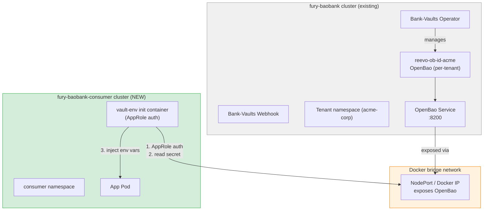
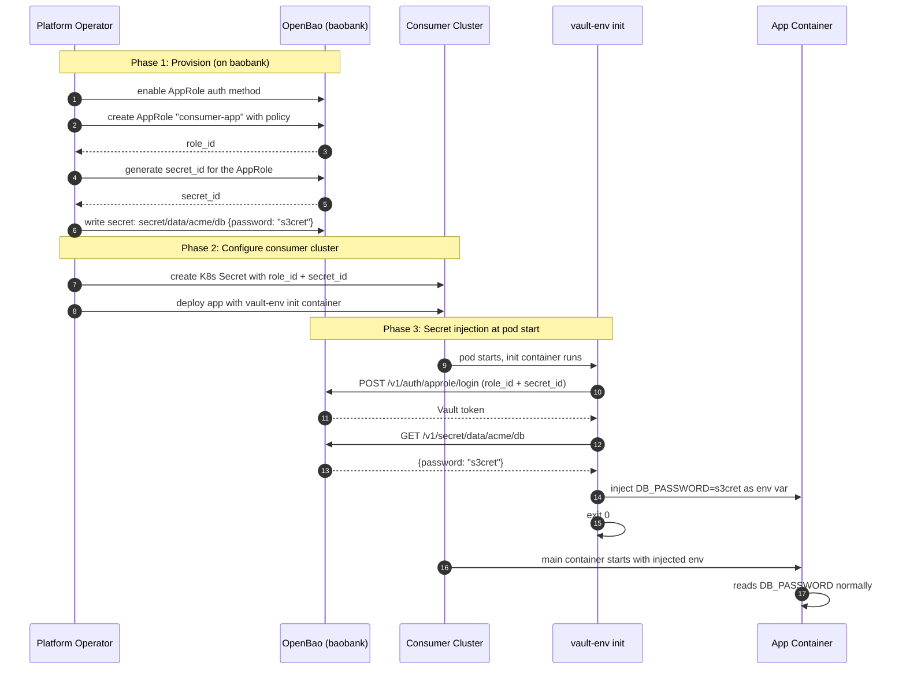

# FD-004: Cross-cluster secret injection via remote OpenBao

## Problem / Problema

FD-003 validated that each tenant gets a dedicated OpenBao instance on the fury-baobank cluster, with working secret injection for pods running on the same cluster. But the SaaS value proposition is that the customer's OpenBao is **theirs to use from anywhere** — including applications running on entirely different clusters that the customer manages independently.

Today there is no validation that a tenant's OpenBao can serve secrets cross-cluster. The authentication model validated in FD-003 (Kubernetes auth) is inherently single-cluster — it relies on the same K8s API server to validate ServiceAccount tokens. A customer running workloads on a separate cluster (their own EKS, GKE, on-prem, or even another Kind cluster) cannot use Kubernetes auth against an OpenBao instance that trusts a different API server.

This scenario must prove:

1. A second Kind cluster ("fury-baobank-consumer") with no Vault infrastructure can consume secrets from a tenant's OpenBao on fury-baobank.
2. The authentication path works cross-cluster (AppRole or Token auth, since K8s auth is cluster-local).
3. The secret is delivered to the application transparently (env var or file), without the app needing Vault client code.
4. The end-to-end flow — secret write on baobank, secret read from consumer cluster — works reliably.

Without this, the SaaS offering is limited to "your Vault works only for apps on our platform" — a significantly weaker value proposition than "your Vault works for all your apps, everywhere."

## Solutions Considered / Soluzioni Considerate

### Option A / Opzione A — Vault Agent sidecar on consumer cluster

Deploy a Vault Agent sidecar alongside the app pod on the consumer cluster. The agent authenticates to the remote OpenBao using AppRole (pre-shared role_id + secret_id), fetches secrets, and writes them to a shared volume that the app reads.

- **Pro:** Official HashiCorp/OpenBao pattern — well-documented, production-proven.
- **Pro:** Supports auto-renewal and secret rotation without pod restart.
- **Pro:** Secrets delivered as files (tmpfs) — more secure than env vars (not in `/proc/*/environ`).
- **Pro:** No webhook or operator needed on the consumer cluster — just a sidecar.
- **Con / Contro:** Requires Vault Agent image on the consumer cluster — adds a container per pod.
- **Con / Contro:** AppRole `secret_id` must be provisioned and rotated — operational overhead for the customer.
- **Con / Contro:** More complex pod spec (sidecar + shared volume + init wait).

### Option B (chosen) / Opzione B (scelta) — vault-env init container with AppRole auth

Deploy the `vault-env` binary (from Bank-Vaults) as an init container on the consumer cluster. It authenticates to the remote OpenBao using AppRole, fetches secrets, and injects them as environment variables into the main container. No sidecar running alongside.

- **Pro:** Minimal footprint — init container runs once at pod start, then exits. No ongoing sidecar.
- **Pro:** Env var injection — same developer experience as Bank-Vaults webhook on the baobank cluster. The app reads `DB_PASSWORD` from env, doesn't know about Vault.
- **Pro:** Already validated image (`ghcr.io/bank-vaults/vault-env:v1.22.1`) — same used by the webhook.
- **Pro:** Simpler pod spec than Option A (init container, not sidecar).
- **Con / Contro:** No auto-renewal — if the secret changes, the pod must restart to pick up the new value.
- **Con / Contro:** Secrets in env vars are visible in `/proc/*/environ` — accepted for the lab, documented as production concern.
- **Con / Contro:** AppRole auth requires provisioning `role_id` + `secret_id` — same as Option A.

### Option C / Opzione C — Direct Vault API from application code

The app on the consumer cluster uses the OpenBao SDK/client directly to authenticate (AppRole) and read secrets at runtime.

- **Pro:** Maximum flexibility — app controls when and how secrets are fetched.
- **Pro:** Supports dynamic secrets (database credentials, PKI certs).
- **Con / Contro:** Requires Vault-aware application code — violates the "transparent injection" principle.
- **Con / Contro:** Each language needs a Vault SDK — not portable.
- **Con / Contro:** Does not demonstrate the platform value — the customer could do this without our SaaS.

## Architecture / Architettura

### Integration Context / Contesto di Integrazione

### Data Flow / Flusso Dati

## Interfaces / Interfacce

| Component / Componente | Input | Output | Protocol / Protocollo |
|---|---|---|---|
| OpenBao AppRole auth (on baobank) | role_id + secret_id | Vault token | HTTPS (8200) / Vault API |
| OpenBao KV-v2 (on baobank) | Vault token + path | Secret data | HTTPS (8200) / Vault API |
| NodePort / Docker IP exposure | OpenBao Service :8200 | Reachable endpoint from consumer cluster | TCP (Docker bridge) |
| `fury-baobank-consumer` Kind cluster | Kind config (1 node, default CNI) | Running K8s cluster | Kind CLI |
| vault-env init container | `VAULT_ADDR`, `VAULT_AUTH_METHOD=approle`, role_id, secret_id, env var refs | Injected env vars in main container | Vault API + process env |
| K8s Secret (consumer cluster) | AppRole credentials (role_id + secret_id) | Mounted as env in init container | K8s Secret mount |
| `scenarios/scen-secret-inject/` | Scenario scripts + manifests | Reproducible demo | shell + YAML |
| `tests/08-cross-cluster.bats` | Both clusters running | TAP test results | bats |

## Planned SDDs / SDD Previsti

1. **SDD-001: Consumer Kind cluster + OpenBao exposure** — Create `scenarios/scen-secret-inject/cluster/kind-consumer.yaml` (1-node Kind), expose the tenant's OpenBao from baobank via NodePort or Docker IP discovery. Mise task `scen:secret-inject:up` to bring up the consumer cluster.

2. **SDD-002: AppRole auth provisioning on baobank** — Enable AppRole auth method on the test tenant's OpenBao (via Vault CR externalConfig or manual vault commands). Generate role_id + secret_id. Write a test secret to KV-v2. Script to automate provisioning.

3. **SDD-003: vault-env consumer deployment** — Deploy an app pod on the consumer cluster with vault-env init container, AppRole credentials from a K8s Secret, and env var references (`vault:secret/data/acme/db#password`). Verify the app container starts with the injected secret.

4. **SDD-004: BATS test suite + integration wiring** — `tests/08-cross-cluster.bats` covering: consumer cluster up, OpenBao reachable from consumer, AppRole auth works cross-cluster, secret injection works, app pod has correct env var. Mise tasks for scenario lifecycle (`scen:secret-inject:up`, `scen:secret-inject:test`, `scen:secret-inject:down`).

## Constraints / Vincoli

- **Two Kind clusters simultaneously**: Docker must have enough resources. Consumer cluster is minimal (1 node, default CNI).
- **Docker bridge networking**: both Kind clusters share the Docker bridge. OpenBao on baobank must be reachable from consumer pods via the baobank node's Docker IP (not `localhost`).
- **AppRole auth**: Kubernetes auth won't work cross-cluster (different API servers). AppRole is the standard Vault cross-environment auth method.
- **No TLS for lab**: both clusters on Docker bridge — plaintext HTTP for Vault API. Production would require TLS + Ingress/LoadBalancer.
- **No Bank-Vaults operator/webhook on consumer**: the consumer cluster is deliberately minimal — only the vault-env binary (as init container) is vault-aware.
- **Existing tests must not break**: scenario tests are in `tests/08-*` and should only run when the consumer cluster is up. The main `mise run all` (59 tests) must still work independently.
- **Constitution**: spec first — no implementation without approved FD and generated SDDs.

## Verification / Verifica

- [ ] Problem clearly defined
- [ ] At least 2 solutions with pros/cons
- [ ] Architecture diagram present
- [ ] Interfaces defined
- [ ] SDDs listed
- [ ] Consumer Kind cluster "fury-baobank-consumer" created and running
- [ ] OpenBao on baobank reachable from consumer cluster pods (network connectivity)
- [ ] AppRole auth method enabled on tenant's OpenBao
- [ ] AppRole login succeeds from consumer cluster (cross-cluster auth)
- [ ] Secret written on baobank, read from consumer cluster via vault-env
- [ ] App pod on consumer cluster has correct env var value
- [ ] `mise run scen:secret-inject:test` passes all BATS
- [ ] Main `mise run all` (59 tests) still passes independently
- [ ] Review completed (`/fd-review`)

## Notes / Note

- **SaaS validation**: this is the first scenario that proves the multi-cluster value proposition. A customer buys "OpenBao-as-a-Service" and uses it from their own infrastructure — not just from our platform.
- **AppRole vs Token auth**: AppRole is more realistic for a SaaS customer (machine-to-machine auth with renewable credentials). Token auth is simpler but less secure (static long-lived token). Chosen AppRole for realism.
- **vault-env vs Vault Agent**: vault-env is lighter (init container, no sidecar). For the scenario, this is sufficient. A future scenario could validate Vault Agent for auto-renewal use cases.
- **Docker networking**: Kind clusters on the same Docker bridge can reach each other via container IP. `docker inspect` to get the baobank node IP, then the consumer pod uses that IP + NodePort to reach OpenBao.
- **Scenario isolation**: this is the first "scenario" (not an infrastructure FD). It lives in `scenarios/scen-secret-inject/` and has its own mise tasks namespaced under `scen:secret-inject:*`. The main `mise run all` does NOT run scenarios — they're opt-in.
- **Context files consulted**:
  - `.forgia/fd/FD-003-openbao-bank-vaults-operator.md` — per-tenant OpenBao architecture
  - `docs/ARCHITECTURE.md` — Bank-Vaults + OpenBao component diagram
  - `.forgia/architecture/constraints.yaml` — `kind-only`, `no-hashicorp-bsl`
  - `.forgia/constitution.md` — spec-first principle
  - `manifests/plugins/kustomize/openbao-tenant-template/vault-cr-template.yaml` — Vault CR with AppRole potential
