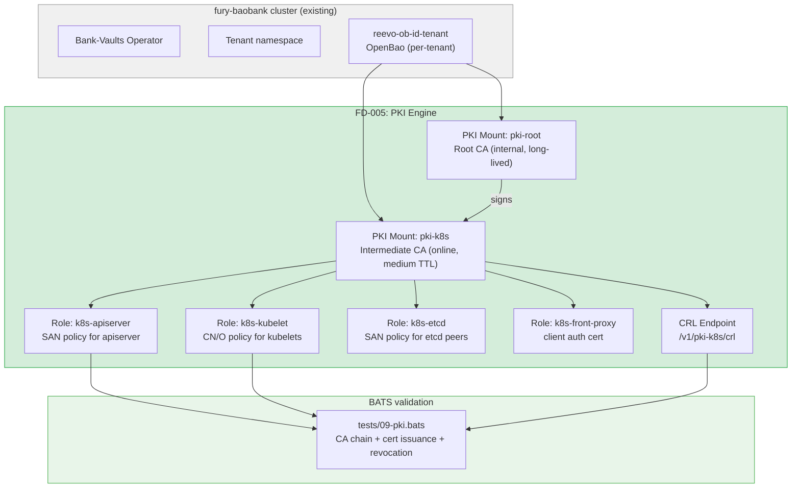
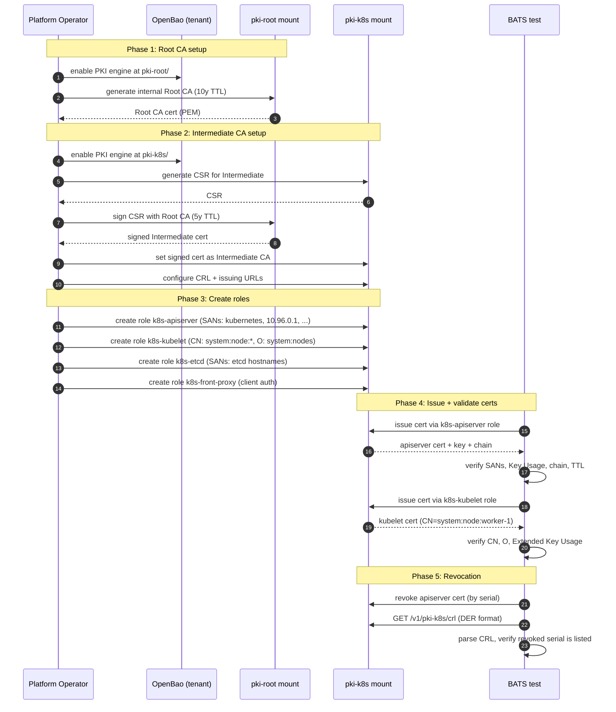

# FD-005: PKI/CA engine for Kubernetes certificate management

## Problem / Problema

Kubernetes clusters rely on a constellation of TLS certificates for secure communication between components: apiserver serving certs, kubelet client certs, etcd peer certs, front-proxy certs, and more. By default, kubeadm generates all of these using a self-signed CA with no external trust chain, no audit trail, no revocation capability, and certificates that expire silently after 1 year.

For on-premises deployments — especially on immutable OS platforms (Flatcar, Talos, Fedora CoreOS) where the filesystem is read-only and nodes bootstrap via sysext — this is a critical gap:

1. **No cert rotation without downtime** — kubeadm cert renewal requires manual intervention or custom scripts; on immutable OS, you can't just `kubeadm certs renew` because the filesystem is sealed.
2. **No revocation** — if a node is compromised, there's no way to revoke its kubelet cert. The node remains trusted until the cert expires (up to 1 year).
3. **No audit trail** — no record of which certs were issued, when, or to whom.
4. **No cross-cluster trust** — each cluster has its own self-signed CA. Federation, mesh, or inter-cluster communication requires manual CA distribution.
5. **No compliance** — self-signed CA with no HSM backing, no CRL/OCSP endpoints, and no policy enforcement does not meet enterprise compliance requirements.

OpenBao's PKI secret engine can solve all of these: it can act as a Root CA (or Intermediate CA under an external Root), issue certificates with short TTLs, enforce SAN and CN policies, maintain a CRL, and log every issuance in the audit trail.

This scenario must prove that a tenant's OpenBao instance can produce **Kubernetes-compatible certificates** with correct SANs, Key Usage, and Extended Key Usage — certificates that K8s components would accept. It does NOT bootstrap a cluster with these certs (that's a future scenario) — it validates that the PKI engine produces correct output.

## Solutions Considered / Soluzioni Considerate

### Option A / Opzione A — Single-tier PKI (Root CA issues leaf certs directly)

A single PKI engine mount acts as both Root CA and issuing CA.

- **Pro:** Simplest — one mount, one CA, no chain to manage.
- **Pro:** Fewer API calls to set up.
- **Con / Contro:** Root CA key is online and used for every issuance — compromise = total PKI compromise.
- **Con / Contro:** No way to rotate the Root CA without replacing all issued certs.
- **Con / Contro:** Not realistic for production — no separation of root and issuing authority.

### Option B (chosen) / Opzione B (scelta) — Two-tier PKI (Root CA + Intermediate CA)

Two PKI engine mounts: `pki-root` (offline, long-lived Root CA) and `pki-k8s` (online, medium-lived Intermediate CA that issues leaf certs).

- **Pro:** **Root CA isolation** — the Root CA mount can be sealed/restricted after signing the Intermediate. Compromise of the Intermediate doesn't compromise the Root.
- **Pro:** **Intermediate rotation** — when the Intermediate CA approaches expiration, generate a new one signed by the same Root. No disruption to existing certs.
- **Pro:** **Standard pattern** — matches how enterprise PKI works (Microsoft AD CS, CFSSL, step-ca). Familiar to security teams.
- **Pro:** **CRL per Intermediate** — revoking a compromised Intermediate invalidates all its issued certs at once.
- **Con / Contro:** More setup — two mounts, cross-signing, role configuration on each.
- **Con / Contro:** Cert chain is 3 certs deep (Root → Intermediate → Leaf) — K8s components must be configured to trust the full chain.

### Option C / Opzione C — External Root CA + OpenBao Intermediate

Import an externally-generated Root CA (e.g., from a hardware HSM or offline ceremony) into OpenBao, then use OpenBao as the online Intermediate CA.

- **Pro:** Root CA never touches OpenBao — maximum security.
- **Pro:** Root CA can be stored in a safe/HSM — meets compliance.
- **Con / Contro:** Requires external tooling to generate the Root CA — out of scope for a Kind lab.
- **Con / Contro:** Adds operational complexity without validating new OpenBao functionality.
- **Con / Contro:** Can be added later by replacing the internal Root with an imported one — not a separate architecture.

## Architecture / Architettura

### Integration Context / Contesto di Integrazione

### Data Flow / Flusso Dati

## Interfaces / Interfacce

| Component / Componente | Input | Output | Protocol / Protocollo |
|---|---|---|---|
| PKI Root mount (`pki-root/`) | `vault write pki-root/root/generate/internal` | Root CA cert (PEM) | Vault API |
| PKI Intermediate mount (`pki-k8s/`) | CSR signed by Root | Intermediate CA cert + CRL | Vault API |
| Role `k8s-apiserver` | SAN list, TTL, key usage | Leaf cert for apiserver | Vault API |
| Role `k8s-kubelet` | CN template, O, TTL | Leaf cert per node | Vault API |
| Role `k8s-etcd` | SAN list, TTL, client+server auth | Leaf cert for etcd peer | Vault API |
| Role `k8s-front-proxy` | CN, TTL, client auth only | Leaf cert for front-proxy | Vault API |
| CRL endpoint | GET `/v1/pki-k8s/crl` | DER-encoded CRL | HTTP |
| `scenarios/scen-pki-ca/` | Scenario scripts + Vault CR config | Reproducible PKI setup | shell + YAML |
| `tests/09-pki.bats` | Running tenant OpenBao with PKI | TAP test results | bats |

## Planned SDDs / SDD Previsti

1. **SDD-001: PKI engine setup via Vault CR externalConfig** — Enable `pki-root` and `pki-k8s` mounts on a test tenant's OpenBao. Generate Root CA, sign Intermediate CA. Configure CRL and issuing URLs. All via Vault CR `externalConfig` where possible, fallback to vault CLI commands in a setup script.

2. **SDD-002: PKI roles for Kubernetes components** — Create roles `k8s-apiserver`, `k8s-kubelet`, `k8s-etcd`, `k8s-front-proxy` with correct allowed_domains, SAN constraints, CN templates, key_usage, ext_key_usage, and TTLs. Document the mapping between each role and the K8s component it serves.

3. **SDD-003: Certificate issuance + validation BATS** — `tests/09-pki.bats` covering: PKI engines mounted, CA chain valid (Root → Intermediate), apiserver cert has correct SANs (kubernetes, kubernetes.default, kubernetes.default.svc, kubernetes.default.svc.cluster.local, 10.96.0.1), kubelet cert has correct CN/O, etcd cert has correct SANs, front-proxy cert has client auth EKU, all certs have short TTL (24h), cert chain validates with `openssl verify`.

4. **SDD-004: Revocation + CRL validation** — Issue a cert, revoke it by serial number, fetch the CRL from the pki-k8s endpoint, parse the CRL (DER → PEM → openssl crl), verify the revoked serial is listed. BATS test cases.

5. **SDD-005: Integration wiring + scenario lifecycle** — `scenarios/scen-pki-ca/` directory with setup/teardown scripts. Mise tasks `scen:pki-ca:setup`, `scen:pki-ca:test`, `scen:pki-ca:teardown`. Documentation of the cert-manager Vault Issuer bridge (future extension — cert-manager on a cluster can request certs from the tenant's OpenBao PKI instead of self-signed).

## Constraints / Vincoli

- **All PKI ops via Vault API** — no manual `openssl` commands for cert generation. Verification with `openssl` is OK (parse/validate output).
- **Two-tier CA chain** — Root CA (internal, 10y) → Intermediate CA (online, 1y) → Leaf certs (24h). Production would use shorter Intermediate TTL.
- **K8s-compatible certs** — must match what kubeadm would generate: correct Key Usage (Digital Signature, Key Encipherment for server; Digital Signature for client), correct Extended Key Usage (Server Auth, Client Auth as appropriate), correct SAN format.
- **OpenBao image < 2.2.0** — same constraint as FD-003 (service registration label break).
- **Scenario does NOT bootstrap a cluster** — validates cert correctness only. Actual cluster bootstrap with OpenBao-issued certs is a future FD.
- **Reuse existing tenant OpenBao** — the PKI engines are mounted on the same OpenBao instance used by the test tenant. No new Vault CR — just externalConfig extensions.
- **Constitution**: spec first, tests required, no hardcoded secrets.

## Verification / Verifica

- [ ] Problem clearly defined
- [ ] At least 2 solutions with pros/cons
- [ ] Architecture diagram present
- [ ] Interfaces defined
- [ ] SDDs listed
- [ ] PKI Root CA engine enabled at `pki-root/`
- [ ] PKI Intermediate CA engine enabled at `pki-k8s/`
- [ ] Root CA signs Intermediate CA (chain validates)
- [ ] Role `k8s-apiserver`: issued cert has SANs kubernetes, kubernetes.default, kubernetes.default.svc, kubernetes.default.svc.cluster.local, 10.96.0.1
- [ ] Role `k8s-apiserver`: cert has Key Usage Digital Signature + Key Encipherment, EKU Server Auth
- [ ] Role `k8s-kubelet`: issued cert has CN=system:node:test-node, O=system:nodes
- [ ] Role `k8s-kubelet`: cert has EKU Client Auth
- [ ] Role `k8s-etcd`: issued cert has correct SANs and both Server Auth + Client Auth
- [ ] Role `k8s-front-proxy`: issued cert has EKU Client Auth only
- [ ] All leaf certs have TTL <= 24h
- [ ] Cert chain validates: `openssl verify -CAfile root.pem -untrusted intermediate.pem leaf.pem`
- [ ] Revoked cert serial appears in CRL
- [ ] CRL is fetchable from `/v1/pki-k8s/crl`
- [ ] `mise run scen:pki-ca:test` passes all BATS
- [ ] Main `mise run all` (59 tests) still passes independently
- [ ] Review completed (`/fd-review`)

## Notes / Note

- **SaaS value**: this scenario proves that the tenant's OpenBao is not just a KV store — it's a full CA. A customer running on-prem K8s clusters can use their OpenBao PKI to issue and manage all cluster certificates, with audit, revocation, and short-lived certs.
- **Immutable OS + sysext path**: the end goal (future FD) is a node boot sequence where a sysext Vault Agent fetches kubelet certs from OpenBao at boot, writes them to `/etc/kubernetes/pki/`, and kubelet starts with fresh, short-lived, auditable certs. This FD validates the PKI engine produces the right certs; the boot sequence is a separate concern.
- **cert-manager Vault Issuer bridge**: cert-manager has a native Vault Issuer type. In a future extension, cert-manager on a customer's cluster could request certs from their OpenBao PKI — unifying webhook TLS, ingress TLS, and K8s component certs under one CA. Documented as a future SDD, not in scope for this FD.
- **TPM attestation for node auth**: on bare-metal with no cloud metadata, Vault's TPM auth or a pre-sealed token in the sysext image would be the authentication method. Not validated in this FD — documented as a constraint for the bootstrap FD.
- **OCSP**: OpenBao supports OCSP in addition to CRL. Not validated in this FD — CRL is sufficient to prove revocation works. OCSP can be added later.
- **Context files consulted**:
  - `.forgia/fd/FD-003-openbao-bank-vaults-operator.md` — per-tenant OpenBao architecture
  - `docs/ARCHITECTURE.md` — component diagram
  - `.forgia/architecture/constraints.yaml` — `no-hashicorp-bsl`, `kind-only`
  - `.forgia/constitution.md` — spec-first, tests required
  - `manifests/plugins/kustomize/openbao-tenant-template/vault-cr-template.yaml` — Vault CR externalConfig structure
- **Upstream references**:
  - OpenBao PKI engine: https://openbao.org/docs/secrets/pki/
  - Vault PKI tutorial: https://developer.hashicorp.com/vault/tutorials/secrets-management/pki-engine (API-compatible with OpenBao)
  - K8s PKI requirements: https://kubernetes.io/docs/setup/best-practices/certificates/
