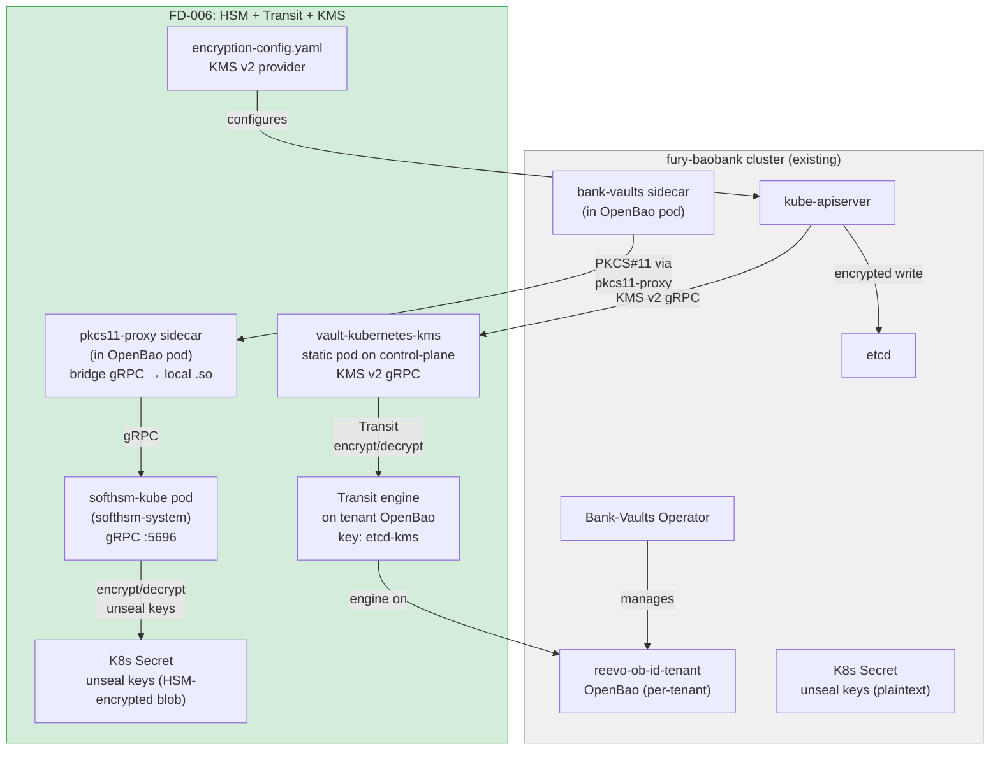
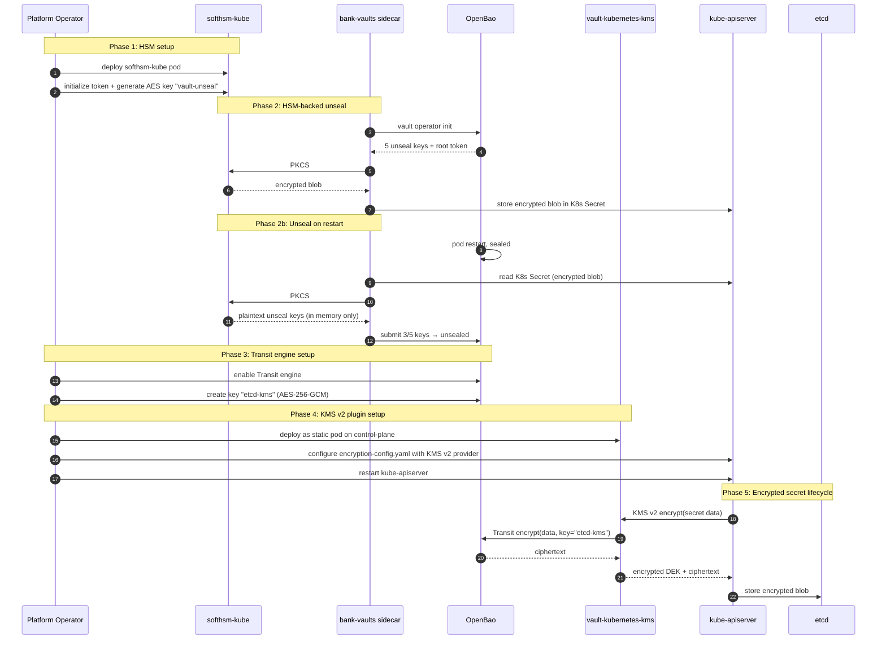

# FD-006: HSM-backed unseal + etcd encryption via Transit

## Problem / Problema

FD-003 validated per-tenant OpenBao instances with auto-unseal, but the unseal keys are stored as **plaintext in a Kubernetes Secret**. Anyone with `get secrets` RBAC in the tenant namespace — or anyone who dumps etcd — reads the unseal keys and gains full access to the tenant's entire secret store. This is the single biggest security gap in the current stack.

Additionally, all Kubernetes Secrets (not just unseal keys) are stored in etcd with only a static AES key for encryption-at-rest. This static key is generated once by kubeadm and never rotated. If etcd is compromised, every Secret in the cluster is exposed.

For the SaaS offering, these two gaps are blockers for enterprise customers:

1. **Unseal key exposure** — the most sensitive credential in the system (grants total access to a tenant's Vault) is stored in the weakest possible way (plaintext K8s Secret). Enterprise customers expect HSM-backed key protection where key material never exists in plaintext outside the HSM boundary.

2. **etcd encryption-at-rest** — Kubernetes' built-in encryption uses a static key with no rotation, no audit, and no external key management. Enterprise compliance (SOC2, ISO 27001, PCI-DSS) requires encryption keys managed by a KMS with rotation and audit capabilities.

This scenario validates the "premium tier" security upgrade: HSM-backed unseal via softhsm-kube + etcd encryption via OpenBao Transit as KMS v2 provider. The result is double encryption — even if etcd is dumped AND the K8s Secret is read, the unseal keys are still HSM-encrypted.

## Solutions Considered / Soluzioni Considerate

### Option A / Opzione A — HSM unseal only (no etcd encryption)

Deploy softhsm-kube and configure Bank-Vaults to use PKCS#11 for unseal key encryption. etcd remains with static-key encryption.

- **Pro:** Simpler — only one new component (softhsm-kube). No kube-apiserver modification.
- **Pro:** Solves the most critical gap (unseal key exposure).
- **Con / Contro:** etcd secrets (including the HSM-encrypted unseal keys) are still encrypted with a static key — a step up from plaintext but not KMS-grade.
- **Con / Contro:** Does not demonstrate the full security posture needed for enterprise compliance.

### Option B (chosen) / Opzione B (scelta) — HSM unseal + Transit KMS for etcd (double encryption)

Three integrated pieces: softhsm-kube for HSM-backed unseal, OpenBao Transit engine for envelope encryption, and vault-kubernetes-kms as the KMS v2 plugin for kube-apiserver.

- **Pro:** **Double encryption** — unseal keys are HSM-encrypted (layer 2), and all K8s Secrets (including the HSM blob) are Transit-encrypted in etcd (layer 1).
- **Pro:** **Full KMS lifecycle** — Transit supports key rotation, the KMS v2 API supports re-encryption on rotation, and every encrypt/decrypt is logged in OpenBao's audit trail.
- **Pro:** **Validates the premium SaaS tier** — enterprise customers get HSM + KMS as a single upgrade.
- **Pro:** **Uses existing infrastructure** — Transit is just another engine on the tenant's OpenBao (no new Deployment). softhsm-kube is the only new pod.
- **Pro:** **vault-kubernetes-kms is community-proven** (62 stars, actively maintained, OpenBao-compatible).
- **Con / Contro:** Requires kube-apiserver configuration change (`encryption-config.yaml`) — on Kind this means extraMounts + node restart. Not managed by furyctl.
- **Con / Contro:** Three moving pieces (softhsm-kube + Transit + vault-kubernetes-kms) — failure in any one breaks the chain.
- **Con / Contro:** PKCS#11 over network (softhsm-kube pod) requires a bridge mechanism — Bank-Vaults expects a local `.so` library, not a remote gRPC endpoint.
- **Con / Contro:** softhsm-kube must reach MVP before this scenario can run (external dependency on new repo).

### Option C / Opzione C — Cloud KMS only (no HSM, no Transit)

Use AWS KMS or GCP KMS for both unseal and etcd encryption.

- **Pro:** Simplest for cloud deployments — one external service for all crypto.
- **Pro:** aws-encryption-provider is SIG-maintained (226 stars).
- **Con / Contro:** Violates the `kind-only` constraint — requires cloud credentials in the local lab.
- **Con / Contro:** Does not validate the on-prem/immutable-OS use case — cloud KMS is not available in air-gapped environments.
- **Con / Contro:** Does not exercise softhsm-kube (the new repo).

## Architecture / Architettura

### Integration Context / Contesto di Integrazione

### Data Flow / Flusso Dati

## Interfaces / Interfacce

| Component / Componente | Input | Output | Protocol / Protocollo |
|---|---|---|---|
| softhsm-kube pod | gRPC requests (encrypt, decrypt, generateKey) | Crypto results (ciphertext, plaintext, key handle) | gRPC :5696 (PKCS#11 subset) |
| pkcs11-proxy sidecar | PKCS#11 C API calls from bank-vaults | Forwarded to softhsm-kube via gRPC | Unix socket (local) → gRPC (network) |
| Bank-Vaults sidecar | Unseal keys + PKCS#11 module path | HSM-encrypted unseal key blob in K8s Secret | PKCS#11 via pkcs11-proxy |
| OpenBao Transit engine | `transit/encrypt/etcd-kms` + plaintext | Ciphertext (AES-256-GCM) | Vault API (HTTP :8200) |
| vault-kubernetes-kms | KMS v2 EncryptRequest/DecryptRequest from apiserver | Envelope-encrypted data via Transit | gRPC (unix socket) + Vault API |
| kube-apiserver | encryption-config.yaml (KMS v2 provider) | All Secrets encrypted before etcd write | K8s API → KMS v2 gRPC |
| `scenarios/scen-hsm-transit/` | Scenario scripts + manifests | Reproducible demo | shell + YAML |
| `tests/10-hsm-transit.bats` | Running cluster with all 3 pieces | TAP test results | bats |

## Planned SDDs / SDD Previsti

1. **SDD-001: softhsm-kube deployment + token initialization** — Deploy softhsm-kube pod from the `Deepzima/softhsm-kube` repo image (or build locally). Initialize a PKCS#11 token and generate the AES wrapping key for unseal. Verify the pod is healthy and the key is usable.

2. **SDD-002: Bank-Vaults HSM unseal configuration** — Configure the test tenant's Vault CR `unsealConfig.hsm` to use PKCS#11 via pkcs11-proxy sidecar pointing at softhsm-kube. Verify unseal keys in the K8s Secret are HSM-encrypted blobs (not plaintext). Verify unseal works after pod restart.

3. **SDD-003: Transit engine + vault-kubernetes-kms setup** — Enable Transit engine on the test tenant's OpenBao, create key `etcd-kms`. Deploy vault-kubernetes-kms as static pod. Configure Kind's kube-apiserver with encryption-config.yaml (KMS v2 provider). Restart apiserver.

4. **SDD-004: BATS test suite + validation** — `tests/10-hsm-transit.bats` covering: softhsm-kube pod healthy, unseal keys are HSM-encrypted (not plaintext base64), OpenBao unseals after pod delete, Transit engine enabled, KMS plugin healthy, new Secret is encrypted in etcd (etcdctl raw read shows blob, not plaintext), existing Secrets re-encrypted after KMS migration.

5. **SDD-005: Integration wiring + scenario lifecycle** — `scenarios/scen-hsm-transit/` directory. Mise tasks `scen:hsm-transit:up`, `scen:hsm-transit:test`, `scen:hsm-transit:down`. Documentation of the PKCS#11 bridge mechanism. Production considerations (real HSM swap, key ceremony, backup procedures).

## Constraints / Vincoli

- **softhsm-kube dependency**: the `Deepzima/softhsm-kube` repo must reach MVP (gRPC server + PKCS#11 encrypt/decrypt) before this scenario can run. Image must be built and pushable to a registry (GHCR or local Kind load).
- **PKCS#11 network bridge**: Bank-Vaults expects `modulePath: /path/to/libsofthsm2.so` (local library). For a remote softhsm-kube pod, a bridge is needed. Options: (a) `pkcs11-proxy` sidecar in the OpenBao pod that exposes a local Unix socket forwarding to softhsm-kube gRPC, (b) mount SoftHSM2 library locally but with token storage on a network volume (NFS/iSCSI from softhsm-kube), (c) custom PKCS#11 `.so` shim that speaks gRPC. Decision deferred to SDD-002.
- **Kind kube-apiserver modification**: `encryption-config.yaml` must be mounted via Kind's `extraMounts` in `kind.yaml`. Requires cluster recreation or control-plane node restart. This scenario should use a **separate Kind cluster** (e.g., `fury-baobank-hsm`) to avoid breaking the 59-test baseline.
- **KMS v2 requires K8s 1.29+**: our Kind image is 1.31, OK.
- **vault-kubernetes-kms + OpenBao**: API-compatible but not officially tested. Must verify Transit encrypt/decrypt works via the plugin.
- **Scenario isolation**: this scenario is opt-in (`scen:hsm-transit:*` tasks). The main `mise run all` (59 tests) is NOT affected. The scenario may use a separate cluster.
- **Constitution**: spec first, tests required, no hardcoded secrets (HSM PINs in env vars or K8s Secrets, never in YAML).

## Verification / Verifica

- [ ] Problem clearly defined
- [ ] At least 2 solutions with pros/cons
- [ ] Architecture diagram present
- [ ] Interfaces defined
- [ ] SDDs listed
- [ ] softhsm-kube pod deployed and healthy in `softhsm-system`
- [ ] PKCS#11 token initialized with AES wrapping key
- [ ] Bank-Vaults unsealConfig uses PKCS#11 via softhsm-kube
- [ ] Unseal keys K8s Secret contains HSM-encrypted blob (NOT plaintext base64)
- [ ] OpenBao unseals successfully after pod delete + restart (HSM-backed auto-unseal)
- [ ] Killing softhsm-kube pod → next unseal attempt fails (proves HSM dependency)
- [ ] Transit engine enabled on tenant OpenBao with key `etcd-kms`
- [ ] vault-kubernetes-kms static pod running on control-plane node
- [ ] kube-apiserver configured with KMS v2 provider
- [ ] New K8s Secret written after KMS setup: raw etcd value is encrypted blob (not plaintext)
- [ ] `kubectl get secret` returns decrypted value (proves KMS decrypt works)
- [ ] `mise run scen:hsm-transit:test` passes all BATS
- [ ] Main `mise run all` (59 tests) still passes independently (scenario isolated)
- [ ] Review completed (`/fd-review`)

## Notes / Note

- **SaaS tier model**: this scenario validates the "premium tier" upgrade path. Base tier = K8s Secret plaintext unseal (FD-003). Premium tier = HSM-backed unseal + KMS etcd encryption (FD-006). The upgrade is additive — you deploy softhsm-kube and reconfigure the Vault CR, no data migration needed.
- **PKCS#11 bridge decision**: the most critical open question. `pkcs11-proxy` (https://github.com/nickelsworth/pkcs11-proxy) is the established tool for remoting PKCS#11 — it runs as a daemon that forwards PKCS#11 calls over TCP/TLS. A sidecar in the OpenBao pod running pkcs11-proxy is the most likely solution. Alternative: use SoftHSM2 library locally in the OpenBao pod but store tokens on a shared volume backed by softhsm-kube (simpler but less isolated).
- **vault-kubernetes-kms static pod**: must start BEFORE kube-apiserver uses it. On Kind, this means the static pod manifest goes in `/etc/kubernetes/manifests/` via Kind extraMounts. The plugin listens on a Unix socket that the apiserver connects to.
- **Key rotation**: Transit supports automatic key rotation (`vault write transit/keys/etcd-kms/config auto_rotate_period=30d`). The KMS v2 API handles re-encryption of existing Secrets with the new key version.
- **Separate cluster**: recommended. Modifying kube-apiserver encryption-config is destructive — if the KMS plugin is down, the apiserver can't decrypt Secrets and the cluster is unusable. A separate `fury-baobank-hsm` Kind cluster isolates this risk.
- **Context files consulted**:
  - `.forgia/fd/FD-003-openbao-bank-vaults-operator.md` — per-tenant OpenBao, unsealConfig
  - `.forgia/fd/FD-003-threat-model.md` — unseal key exposure risk
  - `docs/ARCHITECTURE.md` — component diagram
  - `.forgia/architecture/constraints.yaml` — `kind-only`, `no-hashicorp-bsl`
  - `.forgia/architecture/technology-decisions.yaml` — TD-003 (Raft), TD-004 (K8s Secret unseal)
  - `manifests/plugins/kustomize/openbao-tenant-template/vault-cr-template.yaml` — unsealConfig structure
- **Upstream references**:
  - softhsm-kube: https://github.com/Deepzima/softhsm-kube
  - vault-kubernetes-kms: https://github.com/FalcoSuessgott/vault-kubernetes-kms (62 stars)
  - Bank-Vaults SoftHSM docs: https://bank-vaults.dev/docs/operator/hsm/softhsm/
  - Kubernetes KMS v2: https://kubernetes.io/docs/tasks/administer-cluster/kms-provider/
  - pkcs11-proxy: https://github.com/nickelsworth/pkcs11-proxy
  - kleidi (alternative KMS plugin): https://github.com/beezy-dev/kleidi (18 stars)
