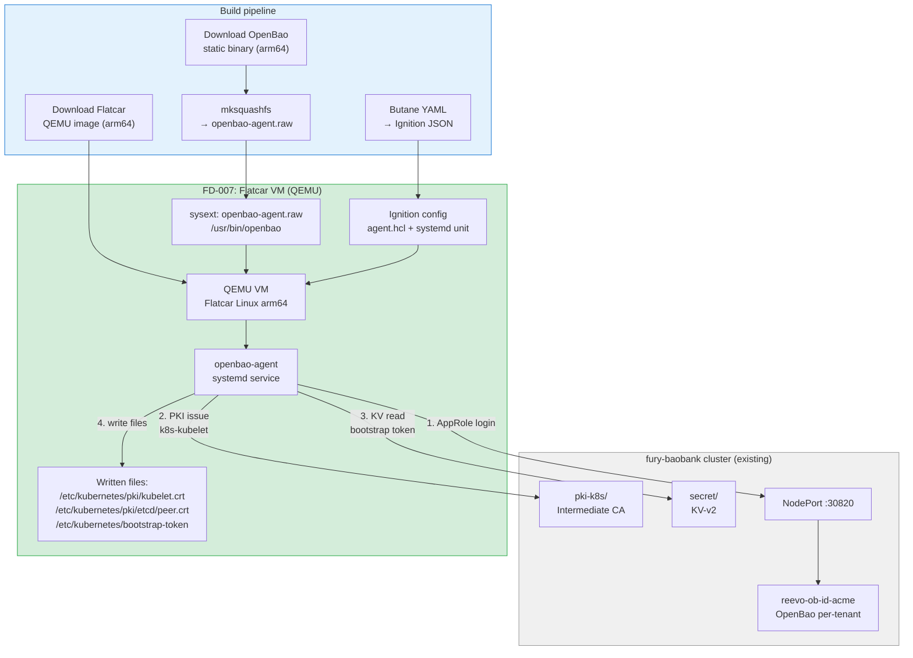
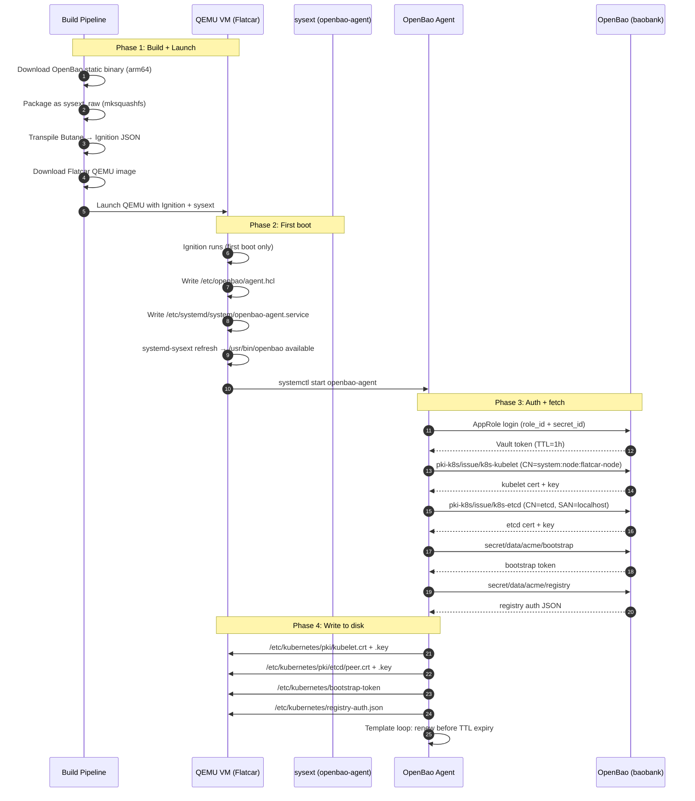

# FD-007: Node bootstrap via sysext OpenBao agent on Flatcar QEMU

## Problem / Problema

FD-005 validated that the tenant's OpenBao PKI engine can produce Kubernetes-compatible certificates (correct SANs, Key Usage, chain, revocation). But those certificates are issued via vault CLI commands executed from inside the cluster — nobody consumes them from the outside, and no node actually boots with them.

The SaaS value proposition for on-premises customers depends on answering: **can a bare-metal node with an immutable OS boot up, fetch its K8s certificates and secrets from the remote OpenBao, and be ready to join a cluster — without any manual intervention?**

Today this is impossible to validate because:

1. **No immutable OS in the lab** — Kind uses Docker containers, not real VMs with read-only filesystems.
2. **No sysext packaging** — the OpenBao agent binary is available as a container image but not as a systemd-sysext (the standard mechanism for extending immutable OS).
3. **No boot-time integration** — there's no Ignition config that starts the agent at boot, fetches certs, and writes them to the expected paths before kubelet starts.
4. **No offline-friendly auth** — the current auth methods (K8s auth, AppRole with live secret_id) require network to the SaaS platform at all times. A node booting in a factory or remote site needs pre-sealed credentials.

This FD extends scen-pki-ca with a real node bootstrap simulation: a Flatcar Linux VM in QEMU with a sysext containing the OpenBao agent, Ignition config, and AppRole auth — proving the complete boot-to-cert-ready pipeline.

## Solutions Considered / Soluzioni Considerate

### Option A / Opzione A — Container simulation (Docker pod as "VM")

Deploy a pod on the consumer Kind cluster that simulates a VM: runs the OpenBao agent binary, fetches certs, writes to a volume.

- **Pro:** Simple — no QEMU, no Flatcar, no sysext packaging. Stays in the Kind ecosystem.
- **Pro:** Fast iteration cycle (pod restart vs VM reboot).
- **Con / Contro:** Not a real immutable OS — doesn't validate sysext packaging, Ignition, systemd integration, or filesystem layout.
- **Con / Contro:** Doesn't prove the SaaS on-prem story — customers won't run pods to bootstrap nodes.
- **Con / Contro:** Misses the hard parts: sysext build, UEFI boot, network discovery.

### Option B (chosen) / Opzione B (scelta) — Flatcar VM in QEMU with sysext + Ignition

Boot a real Flatcar Linux VM in QEMU with:
- sysext: OpenBao agent binary packaged as `.raw` systemd-sysext
- Ignition: first-boot config with agent.hcl, systemd unit, SSH key
- AppRole: pre-sealed role_id + wrapping token for secret_id

- **Pro:** **Real immutable OS** — validates sysext activation, read-only rootfs, Ignition first-boot.
- **Pro:** **Real boot sequence** — proves the agent starts before kubelet, fetches certs, writes to /etc/kubernetes/pki/.
- **Pro:** **Flatcar arm64 available** — runs natively on macOS Apple Silicon (QEMU + UEFI).
- **Pro:** **OpenBao static binary available** — `bao_*_Linux_arm64.tar.gz` from releases, ready for sysext packaging.
- **Pro:** **Reusable sysext** — the `.raw` image can be used on any Flatcar/FCOS deployment, not just the lab.
- **Pro:** **Production-realistic** — this is exactly how an on-prem customer would bootstrap nodes.
- **Con / Contro:** Complex build pipeline (sysext requires `mksquashfs` or `mkfs.ext4` + `dd`).
- **Con / Contro:** QEMU management adds operational complexity (start, wait for boot, SSH, shutdown).
- **Con / Contro:** Slower test cycle than pods (~30s boot vs ~5s pod start).
- **Con / Contro:** Requires QEMU on the dev machine (`brew install qemu`).

### Option C / Opzione C — Talos Linux instead of Flatcar

Talos is another immutable K8s OS. Use the Talos machine config equivalent.

- **Pro:** Talos is purpose-built for K8s (Flatcar is general-purpose).
- **Con / Contro:** Talos does NOT support systemd-sysext — it has its own extension mechanism.
- **Con / Contro:** Talos machine config is not Ignition-compatible.
- **Con / Contro:** Smaller ecosystem for sysext reuse.

## Architecture / Architettura

### Integration Context / Contesto di Integrazione

### Data Flow / Flusso Dati

## Interfaces / Interfacce

| Component / Componente | Input | Output | Protocol / Protocollo |
|---|---|---|---|
| OpenBao static binary | GitHub release tarball (arm64) | `/usr/bin/openbao` in sysext | HTTP download |
| sysext builder | OpenBao binary + sysext metadata | `openbao-agent.raw` squashfs image | mksquashfs CLI |
| Butane config | YAML with agent.hcl, systemd unit, SSH key | Ignition JSON | butane CLI |
| QEMU launcher | Flatcar image + Ignition + sysext | Running VM with SSH | qemu-system-aarch64 |
| OpenBao Agent | `agent.hcl` (VAULT_ADDR, AppRole, templates) | Rendered files on disk | Vault API (HTTP) |
| AppRole "node-bootstrap" | role_id (baked) + secret_id (wrapping token) | Vault token | Vault API |
| PKI issue (via agent template) | Role k8s-kubelet, k8s-etcd | Cert + key PEM files | Vault API |
| KV read (via agent template) | secret/data/acme/bootstrap, registry | Token + JSON files | Vault API |
| BATS tests | SSH into VM | Verify files, certs, services | SSH + openssl |

## Planned SDDs / SDD Previsti

1. **SDD-001: sysext build pipeline** — Script to download OpenBao static binary (arm64), package as systemd-sysext `.raw` file. Output: `scenarios/scen-pki-ca/sysext/openbao-agent.raw`. Verify: `systemd-sysext list` on Flatcar shows the extension.

2. **SDD-002: Ignition/Butane config** — Butane YAML with: agent.hcl (VAULT_ADDR, AppRole, template stanzas for PKI + KV), systemd unit `openbao-agent.service`, SSH authorized key for testing, sysext placement. Transpile to Ignition JSON. Output: `scenarios/scen-pki-ca/ignition/`.

3. **SDD-003: AppRole for node bootstrap** — On tenant OpenBao: create AppRole "node-bootstrap" with policy for `pki-k8s/issue/k8s-kubelet`, `pki-k8s/issue/k8s-etcd`, `secret/data/acme/*`. Generate role_id (baked into Ignition) + wrapping token for secret_id (passed at VM launch). Write KV test data (bootstrap token, registry auth).

4. **SDD-004: QEMU launcher + VM lifecycle** — Script to download Flatcar arm64 QEMU image, launch VM with Ignition + sysext, wait for SSH, configure QEMU networking (user-mode NAT with port forward to OpenBao). Mise tasks `scen:pki-ca:vm-up`, `scen:pki-ca:vm-ssh`, `scen:pki-ca:vm-down`.

5. **SDD-005: BATS tests + integration wiring** — SSH into the VM and verify: openbao binary exists, agent service running, kubelet cert correct (CN, O, SAN), etcd cert correct, bootstrap token file exists, chain validates, cert TTL <= 24h. Mise task `scen:pki-ca:vm-test`. Integration wiring SDD.

## Constraints / Vincoli

- **Flatcar Linux arm64**: native on macOS Apple Silicon via `qemu-system-aarch64`. UEFI boot required (Flatcar arm64 QEMU images are UEFI-only).
- **OpenBao static binary**: `bao_*_Linux_arm64.tar.gz` from GitHub releases. Latest: v2.5.2. Use v2.1.0 for consistency with FD-003 or upgrade — decision in SDD-001.
- **sysext format**: squashfs `.raw` with `/usr/bin/openbao` and `/usr/lib/extension-release.d/extension-release.openbao-agent`. Must match Flatcar's OS release ID.
- **QEMU**: `brew install qemu` on macOS. User-mode networking (no root/bridging needed). Port forward: host:2222 → VM:22 (SSH), host:8200 exposed via existing Kind NodePort.
- **Ignition**: Butane YAML → Ignition JSON via `butane` CLI (`brew install butane`). Ignition is a first-boot-only provisioning system — re-running requires a fresh VM.
- **AppRole auth**: the VM is not a K8s cluster — no SA token. AppRole is the standard non-K8s auth. role_id baked in Ignition (static, low-sensitivity). secret_id via wrapping token (one-use, passed as QEMU env or virtio-serial).
- **Network**: QEMU user-mode NAT. The VM reaches the host as `10.0.2.2`. Host port-forwards `10.0.2.2:8200` → Kind NodePort `30820` on baobank Docker IP. Or simpler: host runs `socat` bridging.
- **macOS tools**: `qemu-system-aarch64`, `butane`, `mksquashfs` (via `brew install squashfs`). All installable via Homebrew.
- **Stays in scen-pki-ca/**: this is an evolution of FD-005, not a new scenario. New files go under `scenarios/scen-pki-ca/{sysext,ignition,qemu}`.

## Verification / Verifica

- [ ] Problem clearly defined
- [ ] At least 2 solutions with pros/cons
- [ ] Architecture diagram present
- [ ] Interfaces defined
- [ ] SDDs listed
- [ ] sysext `openbao-agent.raw` built and contains `/usr/bin/openbao`
- [ ] Butane config transpiles to valid Ignition JSON
- [ ] Flatcar VM boots in QEMU (arm64 UEFI)
- [ ] systemd-sysext activates: `/usr/bin/openbao` available on the VM
- [ ] openbao-agent.service starts and authenticates via AppRole
- [ ] VM can reach OpenBao on baobank (network connectivity)
- [ ] Agent renders kubelet cert to `/etc/kubernetes/pki/kubelet.crt`
- [ ] kubelet cert has CN=system:node:flatcar-node, O=system:nodes
- [ ] Agent renders etcd cert to `/etc/kubernetes/pki/etcd/peer.crt`
- [ ] Agent renders bootstrap token to `/etc/kubernetes/bootstrap-token`
- [ ] Cert chain validates (openssl verify inside VM)
- [ ] Cert TTL <= 24h
- [ ] Agent auto-renews before TTL expiry (verify with 5-min TTL test)
- [ ] `mise run scen:pki-ca:vm-test` passes all BATS (via SSH)
- [ ] Main `mise run all` (59 tests) still passes independently
- [ ] Review completed (`/fd-review`)

## Notes / Note

- **SaaS on-prem story**: this FD is the capstone of the SaaS validation. It proves the full chain: customer buys OpenBao-as-a-Service → platform provisions their Vault (FD-003) → customer's nodes boot with sysext agent → agent fetches certs + secrets from the remote OpenBao → node joins the K8s cluster. Zero manual steps, zero static credentials on disk (wrapping token is one-use).
- **Flatcar arm64 QEMU**: confirmed available at `https://stable.release.flatcar-linux.net/arm64-usr/current/`. The `flatcar_production_qemu_uefi.sh` launcher script handles QEMU flags.
- **OpenBao static binary arm64**: confirmed at `github.com/openbao/openbao/releases` — `bao_2.5.2_Linux_arm64.tar.gz`. Also available: `bao-hsm` variant for PKCS#11 support (relevant for FD-006).
- **secret_id delivery**: for the lab, pre-seal in Ignition (simple). For production, use a wrapping token delivered via secure channel (IPMI, cloud-init userData, USB key at factory). The wrapping token is one-use — even if intercepted after use, it's worthless.
- **Agent template stanzas**: the agent config uses `template` blocks with `source` (Go template file) and `destination` (output path). Templates can call Vault API inline: `{{ with secret "pki-k8s/issue/k8s-kubelet" "common_name=system:node:flatcar-node" }}{{ .Data.certificate }}{{ end }}`.
- **Reusable sysext**: the `.raw` file built here can be used on any Flatcar/FCOS deployment. Consider publishing it as a release artifact of the softhsm-kube or a new `openbao-sysext` repo.
- **Context files consulted**:
  - `scenarios/scen-pki-ca/` — existing PKI scenario (scripts, tests, README)
  - `.forgia/fd/FD-005-pki-ca-engine-k8s-certs.md` — PKI engine architecture
  - `.forgia/fd/FD-004-cross-cluster-secret-injection.md` — AppRole auth pattern
  - `docs/ARCHITECTURE.md` — component diagram
  - `.forgia/architecture/constraints.yaml` — `kind-only` (extended to QEMU), `no-hashicorp-bsl`
