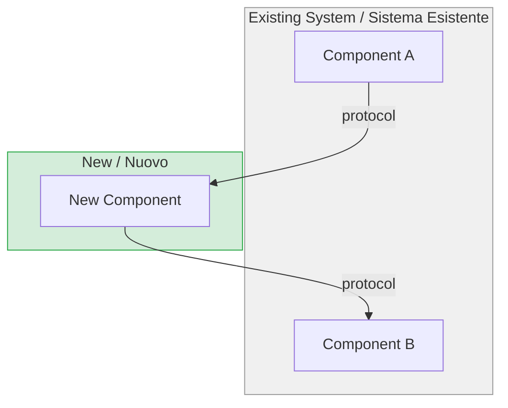
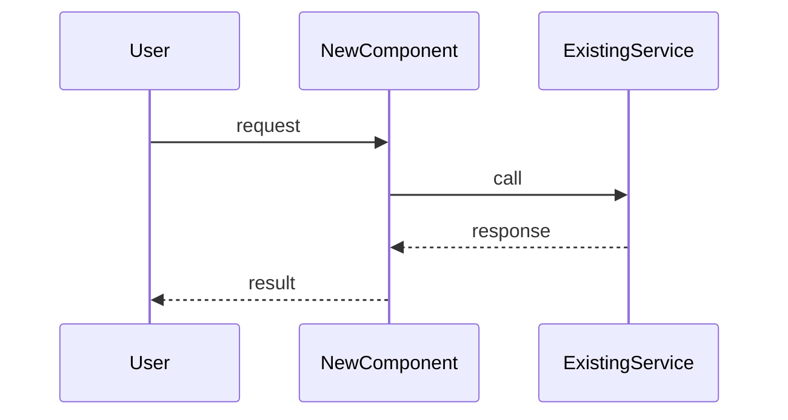

# {{ID}}: {{TITLE}}

## Problem / Problema

<!-- EN: Describe the problem or need. What's broken? What's missing? Why does this matter? -->
<!-- IT: Descrivi il problema o la necessita'. Cosa non funziona? Cosa manca? Perche' serve? -->

## Solutions Considered / Soluzioni Considerate

### Option A / Opzione A

- **Pro:**
- **Con / Contro:**

### Option B (chosen) / Opzione B (scelta)

- **Pro:**
- **Con / Contro:**

## Architecture / Architettura

<!-- EN: MANDATORY — This diagram must show where this feature integrates in the existing system.
     Include: existing components (grey), new components (green), data flow, protocols.
     This is NOT optional — /fd-review will REJECT the FD without a filled diagram. -->
<!-- IT: OBBLIGATORIO — Questo diagramma deve mostrare dove si integra la feature nel sistema esistente.
     Includere: componenti esistenti (grigio), nuovi componenti (verde), flusso dati, protocolli.
     NON e' opzionale — /fd-review RIFIUTERA' il FD senza un diagramma compilato. -->

### Integration Context / Contesto di Integrazione

### Data Flow / Flusso Dati

## Interfaces / Interfacce

<!-- EN: Define interfaces between components that will become separate SDDs -->
<!-- IT: Definisci le interfacce tra i componenti che verranno generati come SDD separati -->

| Component / Componente | Input | Output | Protocol / Protocollo |
|------------------------|-------|--------|-----------------------|
| | | | |

## Planned SDDs / SDD Previsti

<!-- EN: How many SDDs will be generated from this FD? One per component/service -->
<!-- IT: Quanti SDD verranno generati da questo FD? Uno per componente/servizio -->

1. SDD-001: <!-- component 1 / componente 1 -->
2. SDD-002: <!-- component 2 / componente 2 -->

## Constraints / Vincoli

- <!-- technical, time, budget constraints / vincoli tecnici, di tempo, di budget -->

## Verification / Verifica

- [ ] Problem clearly defined / Problema chiaramente definito
- [ ] At least 2 solutions with pros/cons / Almeno 2 soluzioni con pro/contro
- [ ] Architecture diagram present / Diagramma architetturale presente
- [ ] Interfaces defined / Interfacce tra componenti definite
- [ ] SDDs listed / SDD previsti elencati
- [ ] Review completed / Review completata (`/fd-review`)

## Notes / Note

<!-- EN: Additional notes, links, references -->
<!-- IT: Note aggiuntive, link, riferimenti -->
