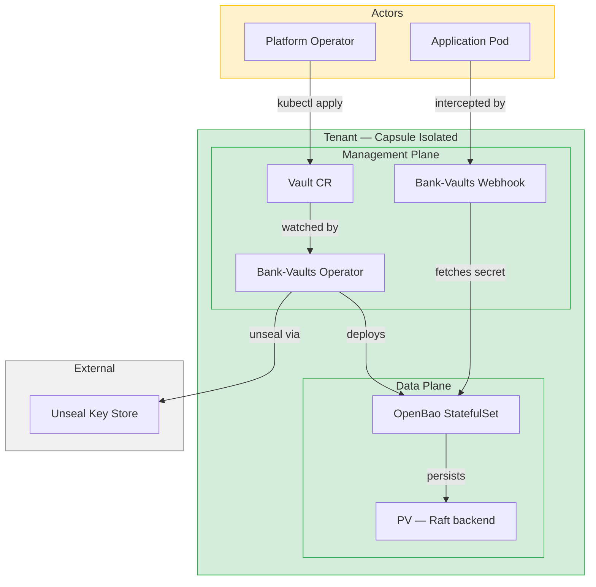
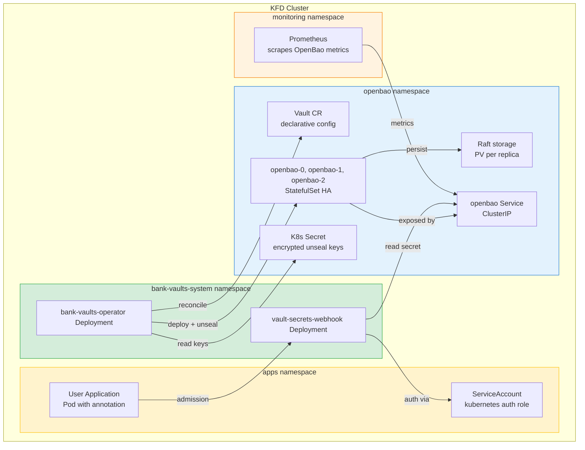
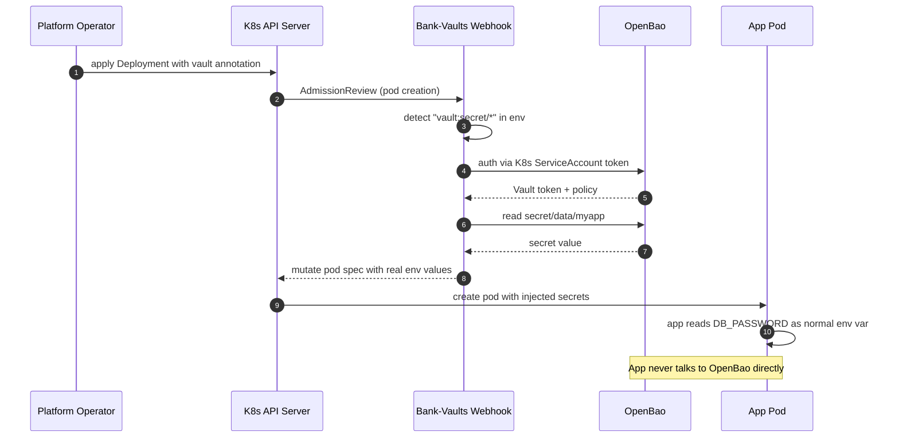
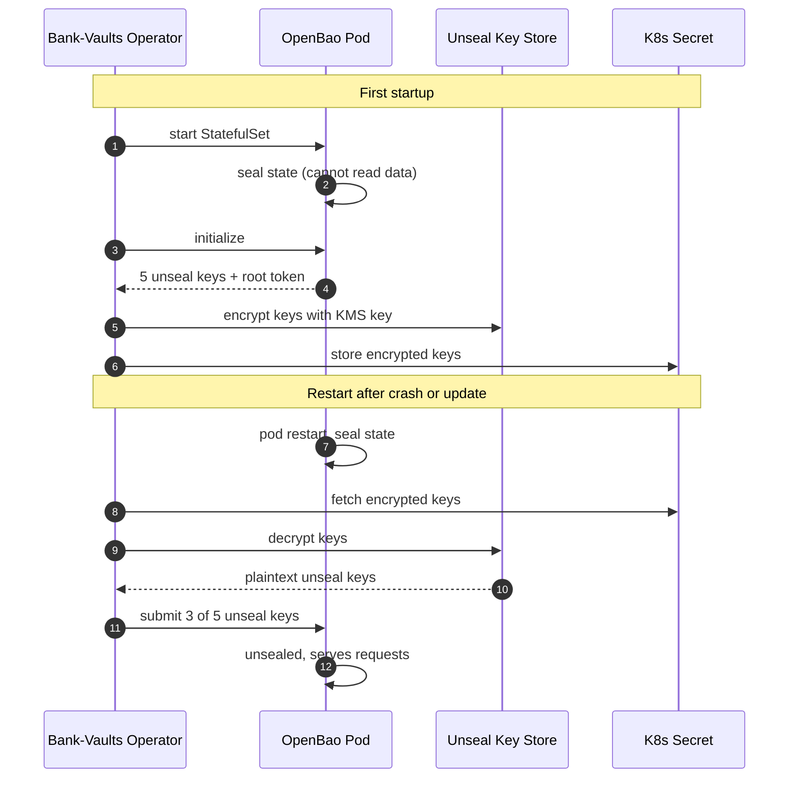

# fury-baobank — Architecture

Lab for testing **OpenBao** + **Bank-Vaults** together on Kubernetes Fury Distribution.

## System Context (C4 Level 1)

High-level view of the actors and the system boundary.

## Container Diagram (C4 Level 2)

Components deployed inside the cluster, their namespaces and relationships.

## Flow: Secret Injection

How an application receives secrets without any Vault-aware code.

## Flow: Auto-Unseal

How OpenBao recovers after restart without human intervention.

## Component Responsibilities

| Component | Responsibility | Namespace |
| --- | --- | --- |
| **Bank-Vaults Operator** | Reconciles `Vault` CRs, deploys OpenBao StatefulSet, manages unseal lifecycle | `bank-vaults-system` |
| **Bank-Vaults Webhook** | Intercepts pod creation, detects Vault annotations, injects secrets | `bank-vaults-system` |
| **OpenBao** | Secret storage, encryption, policy enforcement | `openbao` |
| **Vault CR** | Declarative configuration for a Vault instance (policies, auth methods, engines) | `openbao` |
| **Unseal Secret** | K8s Secret holding encrypted unseal keys | `openbao` |
| **Application** | Consumes secrets via injection — no Vault client code | `apps` |
| **ServiceAccount** | K8s identity used by the app to authenticate to OpenBao via Kubernetes auth method | `apps` |

## Decisions

### Why OpenBao instead of Vault

- Open source under MPL 2.0 (no HashiCorp BSL)
- API-compatible with Vault, so Bank-Vaults tooling should work ^[inferred]
- Linux Foundation governance

### Why Bank-Vaults

- Automates init, unseal, and config that would otherwise require manual steps
- Transparent secret injection via mutating webhook — no app code changes
- Kubernetes-native CRD interface (`Vault` CR)

### Why Raft as storage backend

- Built into OpenBao, no external dependency (Consul)
- HA with 3 replicas, leader election handled natively
- Persistent via StatefulSet PVCs

### Why local K8s Secret for unseal (lab only)

- Simpler than integrating AWS KMS / GCP KMS / HSM in a local Kind cluster
- Not production-safe — production uses cloud KMS or HSM

## Scope — What This Lab Validates

### Completed (59 BATS tests)

- **FD-001**: Kind 3-node cluster + Cilium CNI with kube-proxy-replacement + Hubble mTLS
- **FD-002**: Capsule multi-tenancy (Tenant CRs, quota, namespace isolation, webhook enforcement)
- **FD-003**: Bank-Vaults Operator deploys per-tenant OpenBao instances (not shared — each tenant has its own StatefulSet, Raft storage, unseal keys, KV-v2, Kubernetes auth)
- Auto-unseal works with K8s Secret (lab-only; HSM upgrade planned in FD-006)
- Bank-Vaults Webhook injects secrets into pods via annotations
- Cross-tenant isolation: auth binding, RBAC, no wildcard namespaces

### In-Progress Scenarios

- **FD-004** (scen-secret-inject): Cross-cluster secret consumption — consumer Kind cluster reads secrets from baobank OpenBao via AppRole + vault-env init container
- **FD-005** (scen-pki-ca): PKI/CA engine — OpenBao as two-tier CA (Root → Intermediate) for K8s-compatible certificates with SAN validation, revocation, CRL
- **FD-006** (scen-hsm-transit): Premium security tier — HSM-backed unseal via softhsm-kube + etcd encryption-at-rest via Transit KMS v2

### Out of Scope

- Cloud KMS unseal (AWS/GCP/Azure) — lab is Kind-only
- Cross-cluster replication
- Vaultwarden for human password management
- Production hardening (TLS everywhere, HA OpenBao replicas, backup/restore)
