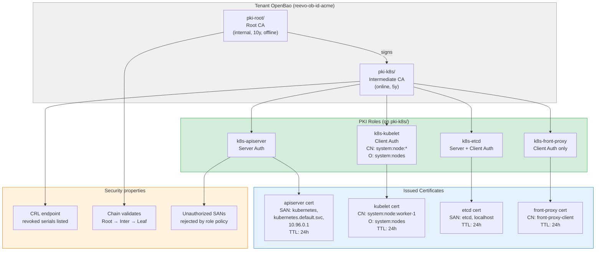
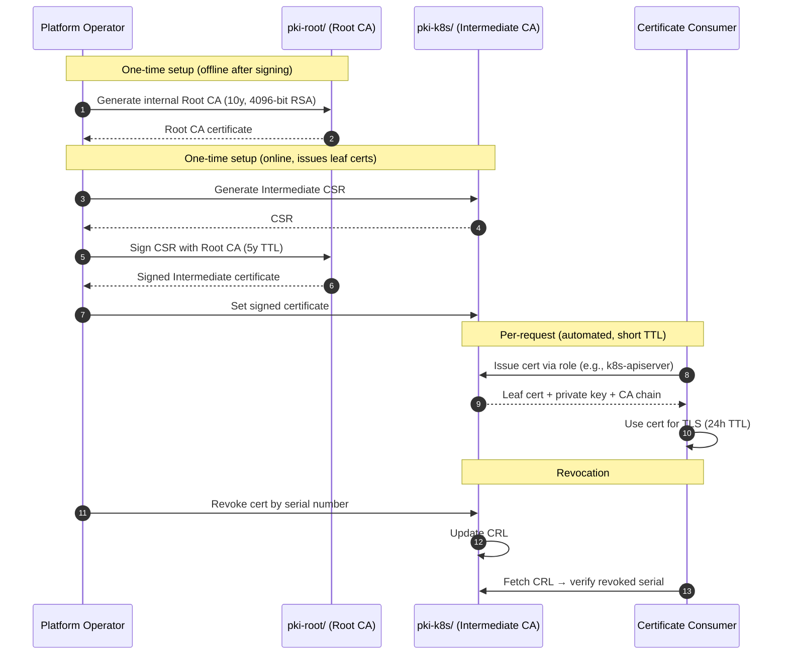

# scen-pki-ca: PKI/CA engine for Kubernetes certificate management

> FD-005 | 21/21 BATS pass | Validated 2026-04-18

## What this scenario proves

A tenant's OpenBao instance can act as a **full PKI Certificate Authority** — issuing Kubernetes-compatible certificates with correct SANs, Key Usage, Extended Key Usage, short TTLs, and revocation via CRL. This replaces kubeadm's self-signed CA with a managed, auditable, revocable PKI.



## Architecture: two-tier PKI



### Why two-tier (not single-tier)

| | Single-tier (Root issues leafs) | Two-tier (Root → Intermediate → leafs) |
|---|---|---|
| Root key exposure | Online, used for every cert | Offline after signing Intermediate |
| Root compromise | Total PKI compromise, no recovery | Revoke Intermediate, issue new one |
| Root rotation | Replace all issued certs | Re-sign Intermediate, leafs unaffected |
| CRL scope | One CRL for everything | CRL per Intermediate |

## Kubernetes certificate requirements

Each K8s component needs specific cert properties. The PKI roles enforce these:

| Component | Role | CN | O | SANs | EKU | TTL |
|---|---|---|---|---|---|---|
| kube-apiserver | `k8s-apiserver` | kubernetes | — | kubernetes, kubernetes.default, kubernetes.default.svc, kubernetes.default.svc.cluster.local, 10.96.0.1, <CP IP> | Server Auth | 24h |
| kubelet (client) | `k8s-kubelet` | system:node:\<hostname\> | system:nodes | — | Client Auth | 24h |
| etcd (peer) | `k8s-etcd` | etcd | — | etcd, localhost, 127.0.0.1 | Server + Client Auth | 24h |
| front-proxy | `k8s-front-proxy` | front-proxy-client | — | — | Client Auth only | 24h |

### Kubelet CN special case

Kubernetes requires kubelet client certs with CN = `system:node:<hostname>` and O = `system:nodes`. The colon `:` in the CN is not a valid hostname character, so the PKI role uses `allow_any_name=true` + `enforce_hostnames=false`. The `organization` field on the role forces O = `system:nodes` on all issued certs.

## Quick start

```bash
cd ~/zimafiles/dev/fury/labs/fury-baobank

# Prerequisites: baobank cluster running with tenant scen-acme
# (created by scen-secret-inject:up or manually)

# Full scenario (< 20s):
mise run scen:pki-ca:all

# Or step by step:
mise run scen:pki-ca:setup     # Root CA + Intermediate CA + 4 roles
mise run scen:pki-ca:test      # 21 BATS tests
mise run scen:pki-ca:teardown  # Disable PKI engines
```

## Commands reference

### Setup

| Command | What it does |
|---|---|
| `mise run scen:pki-ca:setup` | Runs `setup-pki.sh` (Root CA + Intermediate CA) then `setup-roles.sh` (4 K8s roles) |
| `mise run scen:pki-ca:test` | Runs 21 BATS tests (depends on setup) |
| `mise run scen:pki-ca:teardown` | Disables pki-root/ and pki-k8s/ engines |
| `mise run scen:pki-ca:all` | Chains: setup → test |

### Manual cert operations

```bash
# Aliases for vault commands on the tenant's OpenBao
OB_POD=$(kubectl --context kind-fury-baobank get pods -n scen-acme \
  -l app.kubernetes.io/name=vault -o jsonpath='{.items[0].metadata.name}')
ROOT_TOKEN=$(kubectl --context kind-fury-baobank get secret -n scen-acme \
  reevo-ob-id-acme-unseal-keys -o jsonpath='{.data.vault-root}' | base64 -d)

vault_cmd() {
  kubectl --context kind-fury-baobank exec -n scen-acme "$OB_POD" -c vault -- \
    env VAULT_ADDR=http://127.0.0.1:8200 VAULT_TOKEN="$ROOT_TOKEN" vault "$@"
}

# Issue an apiserver cert
vault_cmd write -format=json pki-k8s/issue/k8s-apiserver \
  common_name="kubernetes" \
  alt_names="kubernetes.default,kubernetes.default.svc,kubernetes.default.svc.cluster.local" \
  ip_sans="10.96.0.1,172.18.0.2" \
  ttl=24h

# Issue a kubelet client cert
vault_cmd write -format=json pki-k8s/issue/k8s-kubelet \
  common_name="system:node:worker-1" \
  ttl=24h

# Issue an etcd peer cert
vault_cmd write -format=json pki-k8s/issue/k8s-etcd \
  common_name="etcd" \
  alt_names="localhost" \
  ip_sans="127.0.0.1" \
  ttl=24h

# List all issued certs
vault_cmd list pki-k8s/certs

# Revoke a cert by serial
vault_cmd write pki-k8s/revoke serial_number="<serial>"

# View CRL
vault_cmd read pki-k8s/crl/rotate

# View Root CA cert
vault_cmd read -field=certificate pki-root/cert/ca

# View Intermediate CA cert
vault_cmd read -field=certificate pki-k8s/cert/ca

# Verify chain: Root → Intermediate → leaf
vault_cmd read -field=certificate pki-root/cert/ca > /tmp/root.pem
vault_cmd read -field=certificate pki-k8s/cert/ca > /tmp/inter.pem
# (save leaf cert from issue output) > /tmp/leaf.pem
openssl verify -CAfile /tmp/root.pem -untrusted /tmp/inter.pem /tmp/leaf.pem
```

## Test cases (21)

| # | Group | Test | What it validates |
|---|---|---|---|
| 1 | CA chain | Root CA engine enabled | pki-root/ mount exists |
| 2 | CA chain | Intermediate CA engine enabled | pki-k8s/ mount exists |
| 3 | CA chain | Root CA certificate exists | Internal CA generated |
| 4 | CA chain | Intermediate signed by Root | `openssl verify` chain validation |
| 5 | CA chain | Root has no roles | Offline — only signs Intermediates |
| 6-9 | Roles | 4 roles exist | apiserver, kubelet, etcd, front-proxy |
| 10 | Apiserver | Correct SANs | kubernetes.default.svc.cluster.local, 10.96.0.1 |
| 11 | Apiserver | Server Auth EKU | TLS Web Server Authentication |
| 12 | Apiserver | Key size >= 2048 | RSA 2048+ |
| 13 | Apiserver | TTL <= 24h | Short-lived cert |
| 14 | Kubelet | Correct CN + O | system:node:worker-1, system:nodes |
| 15 | Kubelet | Client Auth EKU | TLS Web Client Authentication |
| 16 | etcd | Server + Client Auth | Both EKUs present |
| 17 | Front-proxy | Client Auth only | No Server Auth EKU |
| 18 | Chain | Full chain validates | Root → Intermediate → leaf OK |
| 19 | Revocation | Revoke succeeds | revocation_time in response |
| 20 | CRL | CRL endpoint accessible | CRL rotate works |
| 21 | Security | Unauthorized SAN rejected | evil.com SAN → 400 error |

## File structure

```
scenarios/scen-pki-ca/
├── README.md                          ← this file
├── scripts/
│   ├── setup-pki.sh                   Root CA + Intermediate CA setup (7 steps)
│   ├── setup-roles.sh                 4 K8s component roles
│   └── teardown-pki.sh                Disable PKI engines
├── tests/
│   └── 01-pki.bats                    21 test cases
└── manifests/                         (empty — PKI is config-only, no K8s resources)
```

## Production considerations

| Lab shortcut | Production requirement |
|---|---|
| Root CA internal (in OpenBao) | External Root CA in HSM, imported as Intermediate signer |
| 10y Root TTL | Root CA offline with 20-30y TTL, in a safe |
| 5y Intermediate TTL | 90-day Intermediate with automated rotation |
| 24h leaf TTL | 1h-24h with Vault Agent auto-renewal |
| HTTP CRL endpoint | HTTPS CRL + OCSP responder |
| Manual cert issuance | cert-manager Vault Issuer for automated K8s cert requests |
| No node bootstrap | sysext Vault Agent fetches certs at boot (FD-006 scope) |
| `allow_any_name=true` on kubelet | Tighter constraint with regex validation on CN pattern |

## Future: cert-manager Vault Issuer bridge

cert-manager has a native [Vault Issuer](https://cert-manager.io/docs/configuration/vault/) type. In production, cert-manager on a customer's cluster could request certs from their OpenBao PKI:

```yaml
apiVersion: cert-manager.io/v1
kind: Issuer
metadata:
  name: openbao-pki
spec:
  vault:
    server: https://reevo-ob-id-acme.scen-acme:8200
    path: pki-k8s/sign/k8s-apiserver
    auth:
      kubernetes:
        role: consumer-app
        mountPath: /v1/auth/kubernetes-consumer
```

This unifies webhook TLS, ingress TLS, and K8s component certs under one CA — all issued by the tenant's OpenBao, all audited, all revocable. Bridges FD-004 (cross-cluster auth) with FD-005 (PKI).
