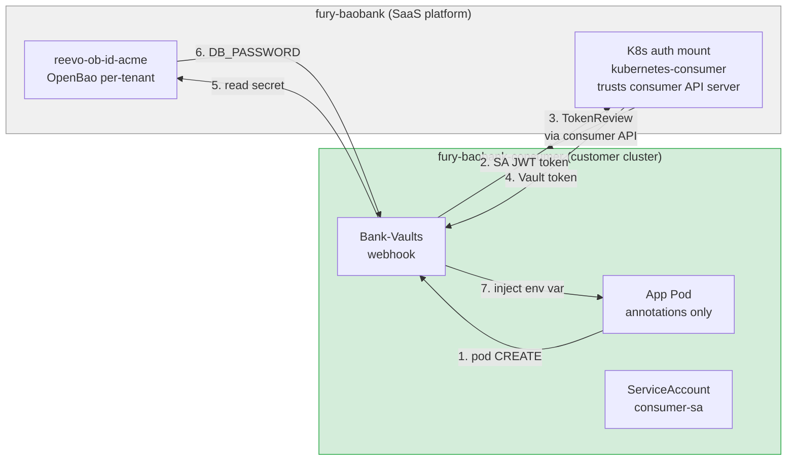
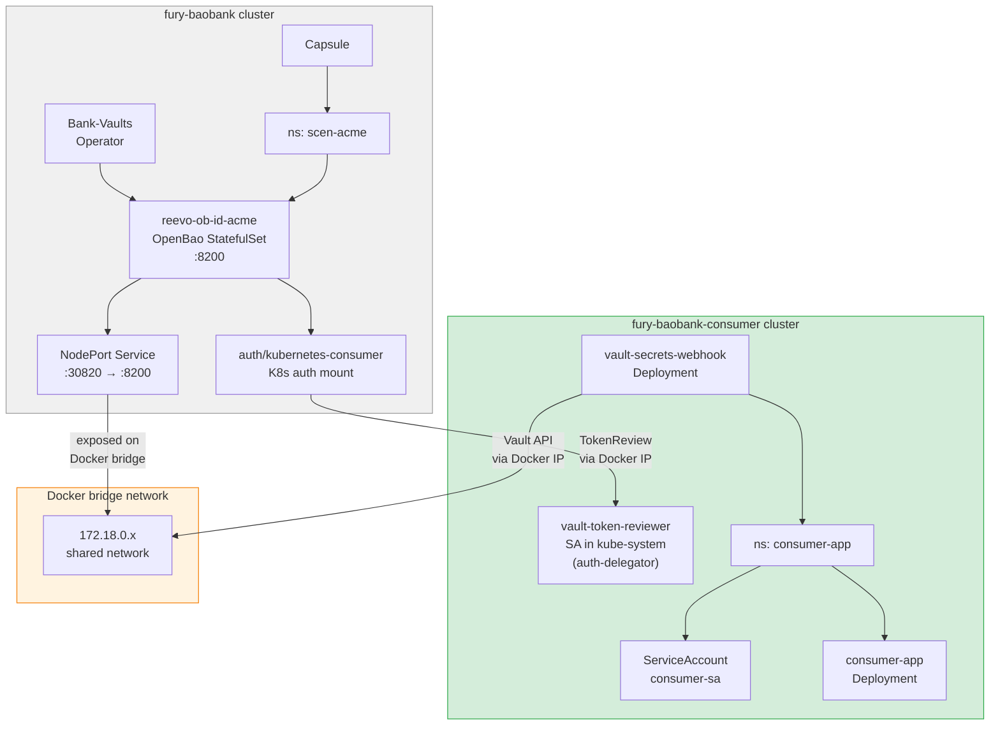
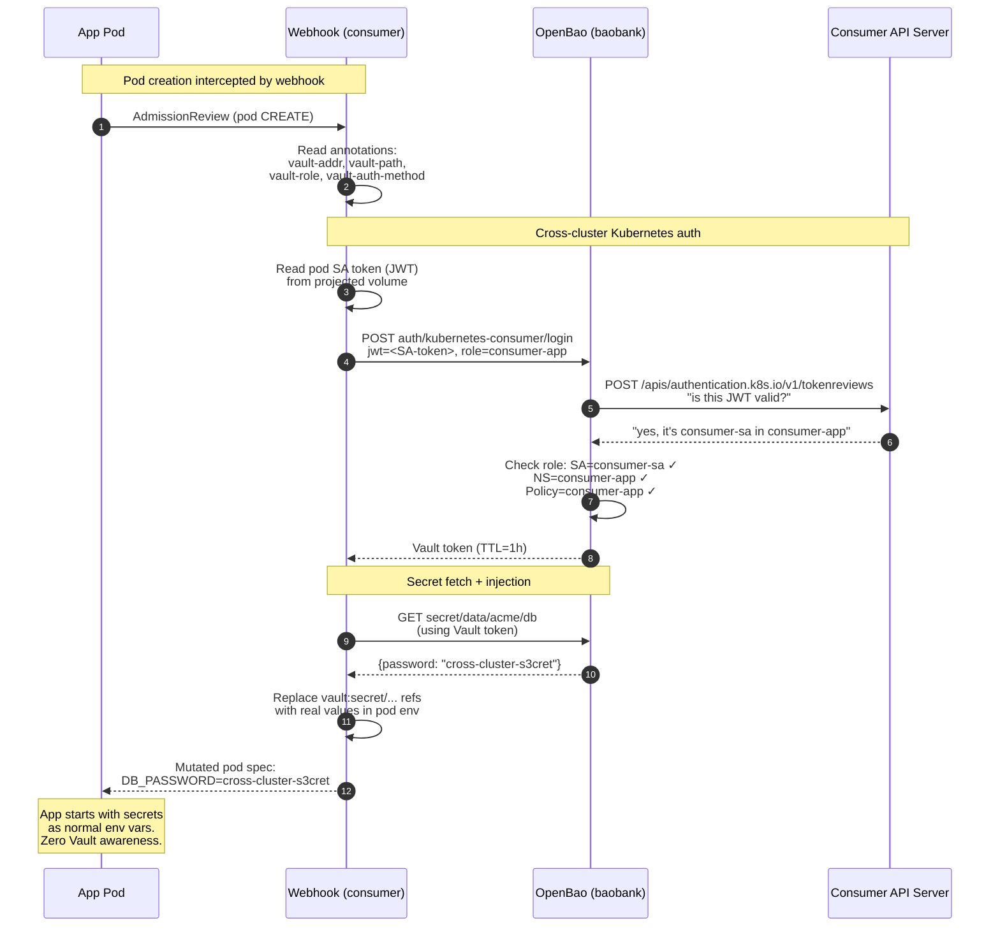

# scen-secret-inject: Cross-cluster secret injection

> FD-004 | 13/13 BATS pass | Validated 2026-04-18

## What this scenario proves

A customer's application running on a **completely separate Kubernetes cluster** can consume secrets from the tenant's OpenBao on the baobank platform — without any static credentials, without Vault client code in the app, and without a Vault instance on the customer's cluster.



## Architecture

### Components



### Authentication flow



## How K8s auth cross-cluster works

Standard Kubernetes auth trusts ONE API server. Cross-cluster extends this by registering an additional API server as a trusted identity source.

### What gets registered

| Item | Where | Purpose |
|---|---|---|
| Consumer API server URL | OpenBao auth config | Where to send TokenReview requests |
| Consumer CA certificate | OpenBao auth config | TLS trust for the consumer API server |
| Token reviewer JWT | OpenBao auth config | Credentials to call TokenReview API on consumer |
| Auth role (consumer-app) | OpenBao auth config | Binds SA name + namespace to a Vault policy |

### The trust chain

```
Consumer cluster issues SA JWT (signed by its own CA)
    ↓
Webhook sends JWT to OpenBao
    ↓
OpenBao calls TokenReview on consumer API server
    ↓
Consumer API server validates its own JWT → "yes, valid"
    ↓
OpenBao checks the role binding (SA + namespace match?)
    ↓
OpenBao issues a scoped Vault token
    ↓
Webhook reads secrets, injects into pod
```

### Pros

- **Zero static credentials** — no AppRole secret_id, no tokens to rotate. The SA JWT is the identity, auto-rotated by Kubernetes.
- **Instant revocation** — delete the SA or namespace on the consumer cluster → next TokenReview fails → access revoked immediately.
- **Per-pod identity** — each pod authenticates with its own SA. Different SAs can have different Vault roles/policies.
- **Same DX as local injection** — the app developer uses the same annotations whether the Vault is local or remote. No code changes.
- **Platform operator controls trust** — only the platform operator (root token) can register new API servers in OpenBao. The customer cannot self-provision trust.

### Cons / Trade-offs

- **Network dependency** — OpenBao must reach the consumer API server (port 6443) for every TokenReview. If the consumer cluster is unreachable, new pods can't start (webhook blocks on auth).
- **Token reviewer SA** — the consumer cluster needs a `vault-token-reviewer` SA with `system:auth-delegator` ClusterRole. This is a privileged SA that the platform operator creates.
- **CA cert lifecycle** — if the consumer cluster rotates its CA (kubeadm cert rotation), the trust breaks until the new CA cert is updated in OpenBao. Needs a process/automation.
- **Docker bridge = no TLS** — in this lab, Vault API traffic crosses the Docker bridge unencrypted. Production requires TLS (Ingress + cert) on the OpenBao endpoint.
- **NodePort exposure** — OpenBao is reachable by ANY container on the Docker bridge, not just the consumer cluster. Production requires IP allowlist or service mesh.
- **Blast radius on consumer compromise** — if the consumer's API server is compromised, an attacker can forge any SA token → authenticates to OpenBao. But they can only access this tenant's secrets (policy scoping). Not worse than "customer lost their database password."

## Quick start

```bash
cd ~/zimafiles/dev/fury/labs/fury-baobank

# Full scenario (5-10 min):
mise run scen:secret-inject:all

# Or step by step:
mise run scen:secret-inject:up         # tenant + OpenBao + consumer cluster
mise run scen:secret-inject:provision   # K8s auth cross-cluster + test secret
mise run scen:secret-inject:deploy      # webhook + app on consumer
mise run scen:secret-inject:test        # 13 BATS tests

# Check injected secrets:
kubectl --context kind-fury-baobank-consumer logs -n consumer-app -l app=consumer-app

# Cleanup:
mise run scen:secret-inject:down
```

## Commands reference

### Setup

| Command | What it does |
|---|---|
| `mise run scen:secret-inject:up` | Creates Capsule tenant `scen-acme`, deploys OpenBao `reevo-ob-id-acme`, waits for init+unseal+config, creates NodePort, creates consumer Kind cluster, discovers Docker IP, writes `.vault-addr` |
| `mise run scen:secret-inject:provision` | Creates `vault-token-reviewer` SA on consumer (auth-delegator), enables `kubernetes-consumer` auth mount on OpenBao, registers consumer API server + CA + reviewer JWT, creates policy `consumer-app` (scoped to `secret/data/acme/*`), creates role `consumer-app` (bound to `consumer-sa` in `consumer-app` ns), writes test secret |
| `mise run scen:secret-inject:deploy` | Installs Bank-Vaults webhook on consumer via Helm (1 replica, self-signed cert), deploys app with vault annotations (envsubst for VAULT_ADDR) |
| `mise run scen:secret-inject:test` | Runs 13 BATS tests |
| `mise run scen:secret-inject:down` | Deletes consumer cluster, removes tenant + OpenBao + NodePort from baobank, cleans runtime files |
| `mise run scen:secret-inject:all` | Chains: up → provision → deploy → test |

### Debugging

```bash
# OpenBao health from consumer cluster
kubectl --context kind-fury-baobank-consumer run test --rm -it \
  --image=curlimages/curl:8.9.1 -- \
  curl -sf $(cat scenarios/scen-secret-inject/.vault-addr)/v1/sys/health

# Webhook logs on consumer
kubectl --context kind-fury-baobank-consumer logs -n bank-vaults-system -l app.kubernetes.io/name=vault-secrets-webhook

# OpenBao audit log (tenant)
kubectl --context kind-fury-baobank exec -n scen-acme \
  $(kubectl --context kind-fury-baobank get pods -n scen-acme -l app.kubernetes.io/name=vault -o jsonpath='{.items[0].metadata.name}') \
  -c vault -- cat /tmp/audit.log | tail -5

# Manual Vault login test from consumer SA
TOKEN=$(kubectl --context kind-fury-baobank-consumer create token consumer-sa -n consumer-app)
curl -sf $(cat scenarios/scen-secret-inject/.vault-addr)/v1/auth/kubernetes-consumer/login \
  -d "{\"jwt\":\"$TOKEN\",\"role\":\"consumer-app\"}"

# Check auth config
kubectl --context kind-fury-baobank exec -n scen-acme \
  $(kubectl --context kind-fury-baobank get pods -n scen-acme -l app.kubernetes.io/name=vault -o jsonpath='{.items[0].metadata.name}') \
  -c vault -- env VAULT_ADDR=http://127.0.0.1:8200 \
  VAULT_TOKEN=$(kubectl --context kind-fury-baobank get secret -n scen-acme reevo-ob-id-acme-unseal-keys -o jsonpath='{.data.vault-root}' | base64 -d) \
  vault read auth/kubernetes-consumer/config
```

## File structure

```
scenarios/scen-secret-inject/
├── README.md                              ← this file
├── cluster/
│   └── kind-consumer.yaml                 1-node Kind, default CNI
├── manifests/
│   ├── kustomization.yaml                 Root (review/docs only)
│   ├── tenant-bao/                        Applied to: fury-baobank
│   │   ├── kustomization.yaml
│   │   ├── tenant-acme.yaml               Capsule Tenant
│   │   ├── vault-rbac-acme.yaml           RBAC for bank-vaults sidecar
│   │   ├── vault-cr-acme.yaml             Vault CR (OpenBao instance)
│   │   ├── nodeport-acme.yaml             NodePort exposure
│   │   └── k8s-auth-consumer.yaml         Doc: cross-cluster auth reference
│   └── tenant-env/                        Applied to: fury-baobank-consumer
│       ├── kustomization.yaml
│       ├── consumer-app.yaml              App + webhook annotations
│       └── webhook-chart-values.yaml      Helm values for webhook
├── scripts/
│   ├── setup-consumer.sh                  Step 1: tenant + OpenBao + consumer cluster
│   ├── provision-approle.sh               Step 2: K8s auth cross-cluster + secret
│   ├── deploy-consumer-app.sh             Step 3: webhook + app on consumer
│   └── teardown.sh                        Cleanup everything
├── tests/
│   └── 01-cross-cluster.bats             13 test cases
└── .vault-addr                            (runtime, gitignored)
```

## Production considerations

| Lab shortcut | Production requirement |
|---|---|
| Docker bridge (no TLS) | Ingress + TLS + cert rotation on OpenBao endpoint |
| NodePort (open to all containers) | LoadBalancer/Ingress + IP allowlist or service mesh |
| `kind create` for consumer | Customer's real cluster (EKS/GKE/on-prem) |
| Manual `vault-token-reviewer` SA | Automated onboarding: platform registers customer's API server |
| 1 webhook replica | 2+ replicas with PDB |
| No NetworkPolicy | Default-deny + allow only webhook → OpenBao endpoint |
| CA cert manually copied | Automated CA cert rotation watcher |
